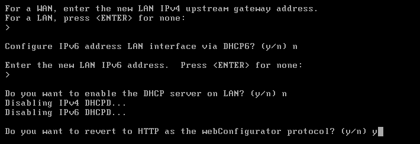
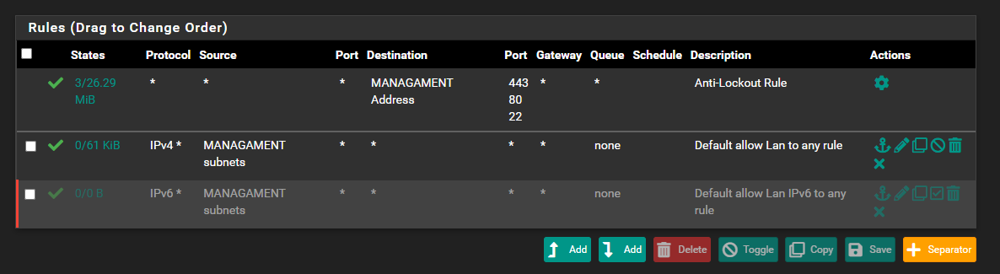
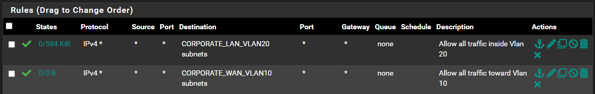

# Part 1: Deploying a Firewall with pfSense

For this firewall deployment, we will use **pfSense**, a powerful open-source firewall solution. It is known for its reliability, rich feature set, and active community support. You can download it from [pfSense's official website](https://www.pfsense.org/download/). pfSense is widely used in both home and enterprise environments due to its flexibility and advanced network control features.

## Virtual Machine (VM) Specifications

We will allocate the following resources to the pfSense VM:
- **CPU**: 2 processors, 2 cores per processor (for fast installation, it can be adjusted later to 1*1)
- **RAM**: 4GB (for fast installation, it can be adjusted later to 512 MB)

We will configure **6 network adapters**:
1. **Bridge Adapter** (for WAN)
2. **Management Network Adapter (Vlan1)**
3. **Corporate LAN (Vlan 20) Adapter**
4. **Corporate WAN (Vlan 10) Adapter**
5. **Security Network Adapter (Vlan50)** 
6. **Isolated LAN Adapter (Vlan99)**

After adding each adapter, we will go to the advanced settings and click “Generate” to automatically assign a MAC address for each interface. You can also copy these addresses to a text file for future reference.

---

## Installation

The installation of pfSense is straightforward:

1. Accept the license agreement and select **Install Pfsense**.
2. Choose the **WAN interface** (the bridge adapter we set up). You can identify it by its MAC address.

   
   
3. Next, choose the **LAN interface**, which corresponds to the **Management Network** (e.g., vmnet1).

   
   
4. Choose **WAN**.

   
   
5. The installer will check network connectivity; if any errors occur, keep trying to proceed to the next step.
6. Select the **CE (Community Edition)** installation option and proceed with the default settings until installation begins.
7. After installation completes, the system will prompt for a reboot.
8. Once rebooted, pfSense will boot with two configured interfaces: **WAN** and **LAN**.

   
   
---

## Configuring the pfSense LAN Interface

1. Access the pfSense CLI and enter **2** to choose **Set interface(s) IP address**.
2. Use option **2** to set the IP address for the **LAN (Management)** interface.
   - Enter **10.0.1.50** for the IP address and **24** for the subnet mask.

     
     
   - Leave IPv6 disabled (enter **no** when prompted).
   - Enable HTTP for the **web configurator** by selecting **y**.

     

     
     
You can now access the pfSense web interface at `http://10.0.1.50` and log in with the default credentials:
- **Username**: admin
- **Password**: pfsense

---

## Basic Configuration

After logging in, we need to set up our pfSense. We can continue with the default parameters, but we need to adjust a few settings. Set the hostname to **"firewall"** and the domain to something like **nixus.homelab** (the same domain we will use for Active Directory later). Set the timezone according to your region. You can either change the web interface IP or keep the default one. Finally, enter a new password for logging in next time. 

Once done, wait for the page to reload automatically and click **Finish**.

---

## DNS and Interface Settings

1. Go to **System > General Setup** and set the **DNS servers** to:
   - **8.8.8.8** (Google DNS)
   - **8.8.4.4** (Google DNS)
2. You can switch to **dark mode** theme in the settings if you prefer.
3. Next, navigate to **System > Advanced > Admin Access**. Enable **HTTPS/SSL** for secure web access.
4. Scroll down and enable the **Secure Shell (SSH) Server** to allow SSH access for future management.

---

## Interface Assignment

### Assigning Interfaces to pfSense

First, you will need to assign all interfaces to pfSense. This can be done by going to **Interfaces > Interface Assignments** and then clicking the **Add** button for each interface in the list, followed by clicking the **Save** button. This will add all your interfaces and assign generic names to each of them (e.g., OPT1, OPT2, etc.).

### Enabling and Configuring Interfaces

Next, enable and configure each interface with the correct description and IP address. Do not modify the WAN interface at this stage. Open each other interface according to the following instructions:

- **Enable**: Checked
- **Description**: `Network Name_Vlan<VLAN_NUMBER>`
- **IPv4 Configuration Type**: Static IPv4
- **IPv6 Configuration Type**: None
- **MAC Address**: Leave empty
- **MTU**: Leave empty
- **MSS**: Leave empty
- **Speed and Duplex**: Default
- **IPv4 Address**: The IP address of the interface from the table below. Set the mask to `/24`
- **IPv4 Upstream Gateway**: None
- **Block Private Networks**: Unchecked
- **Block Bogon Networks**: Unchecked

Your configuration should resemble the one in the image below.

### Interface IP Configuration Table

| Interface         | IP Address         |
|-------------------|--------------------|
| **Management**     | 10.0.1.50/24       |
| **Corporate WAN**  | 10.0.10.254/24     |
| **Corporate LAN**  | 10.0.20.254/24     |
| **Security**       | 10.0.50.254/24     |
| **Isolation LAN**  | 10.0.99.254/24     |

After configuring all interfaces, you should see something like this:

---

## Firewall Configuration

To control network traffic, we will configure firewall rules for each interface. Initially, all traffic is allowed, but as the network grows, we can refine these rules.

### WAN Interface
- Keep the default settings, including blocking private and bogon IP addresses, to protect the network from unauthorized traffic.

### Management Interface
- The management interface will have default rules allowing traffic, with an **anti-lockout rule** enabled.
- We will disable the IPv6 rule but keep the other rules as configured.

### Corporate WAN Interface
- Explicitly allow traffic to **Corporate LAN** and **Corporate WAN** networks.
- Block all other traffic by applying the default "deny all" rule at the end of the rule set.

### Corporate LAN Interface
- This interface will mirror the **Corporate WAN** interface rules, simulating internet access.

### Security Network
- This network will be restricted from accessing the **WAN**, **Management**, or **Corporate WAN** networks, but will have access to other allowed networks.

### Isolation LAN
- The **Isolated LAN** will be completely isolated from other networks, with a "deny all" rule blocking all incoming traffic. We will define an explicit rule to enforce this isolation.

---

## Outbound Rules

To enable internet access for the **Security Network** and simulate internet access for other networks via a fake WAN, we will configure **outbound rules** under **Firewall > NAT > Outbound**.

---

## Conclusion

We successfully deployed and configured a **pfSense firewall**, setting up multiple network interfaces, DNS, and firewall rules to secure network traffic. 

Next, we will configure a **domain controller** with Active Directory and set up **two client endpoints** to connect to the domain, simulating a corporate LAN environment.
