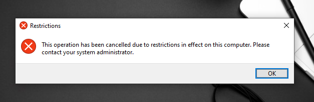

# Part 2: Configuring Active Directory and Implementing GPOs on Windows Server 2019

This guide covers the configuration of a **Windows Server 2019** as a domain controller, complete with Active Directory, DNS, and file-sharing services. It's ideal for building a test lab environment using the Windows Server 2019 Evaluation. You can download the evaluation version from [Microsoft's Evaluation Center](https://www.microsoft.com/en-us/evalcenter/evaluate-windows-server-2019).

## Configuration Steps

### 1. Network and Hostname Setup
Begin by configuring the server's network settings and hostname to ensure stable communication across your network:
- Assign the network adapter to **VLAN 20**.
- Set a **static IP address**, which is crucial for ensuring reliable access to services like Active Directory and DNS.
  


- Rename the server for easy identification in the network, then restart the server for the changes to take effect.
  


### 2. Installing Roles and Features
Next, install the essential roles and features:
- Go to **Server Manager** > **Manage** > **Add Roles and Features**.
- Install the following:
  - **Active Directory Domain Services (AD DS)**: Essential for managing identities and permissions.
  - **DHCP Server**: Automatically assigns IP addresses.
  - **DNS Server**: Translates domain names to IP addresses.
  - **File and Storage Services**: Enables file-sharing.
  - **Remote Access**: Allows remote management.
    


### 3. Promoting the Server to a Domain Controller
To transform the server into a domain controller:
- In **Server Manager**, click **Promote this server to a domain controller**.
  


- Choose **Add a new forest** and enter a domain name for your network.
  


- Set the Administrator password and keep the default settings till the end.
  


- After setup, the server will restart automatically. If everything went well, you will get a prompt to log in with the user Administrator on your domain.
  


### 4. DHCP Configuration
To configure DHCP:
- Open **Server Manager**, navigate to **Tools** > **DHCP**.

 

- Right-click on **IPv4** and select **New Scope**.


- Enter the name and description of your network. This helps in identifying the scope, especially in environments with multiple networks.
  


- Define a range of available IP addresses. It's essential to reserve a portion of IP addresses for servers and devices that require static IPs (servers, printers…) to prevent conflicts and ensure stable connections.
  


- Ensure the domain controller serves as the **default gateway**, **DNS server**, and **WINS server**.
  


- Complete the process, and you should see your IP pool in **Address Pool**.
  


### 5. DNS Configuration
- We’ll now configure DNS for name resolution, which is vital for enabling devices on your network to find each other.
- Start by setting up a Reverse Lookup Zone, which maps IP addresses to hostnames.
- Go to **Tools** > **DNS** in Server Manager.
- Right-click on **Reverse Lookup Zones**, and **create a new zone**.
- Enter the network ID (10.0.20 for our case) and proceed through the wizard to complete the reverse zone creation.
  


- Add **DNS entries** for important devices in **Forward Lookup Zones**, right-click on your domain and select New Host (A or AAAA).
  


- Enter the device name `firewall` and IP address `10.0.20.254` , and check Create associated pointer (PTR record). This ensures that forward and reverse DNS resolution work in sync.
  
- You can verify your DNS setup by using the `nslookup` command to check if your entries resolve correctly.
  


---

# Users and Groups Configuration

As part of building a Blue Team Lab, we're intentionally simulating poor security practices commonly found in real-world IT environments. One such practice is using weak passwords. Although Microsoft enforces password complexity by default, it's not uncommon for organizations to relax these policies due to user complaints about password complexity. For our lab, we will disable the default password policy to simulate weak password usage, which is a typical vulnerability. You can follow this guide to disable the policy:  
[Disable Password Complexity Requirements on Server 2016](https://www.wintips.org/how-to-disable-password-complexity-requirements-on-server-2016/)

Once the policy is adjusted, we’ll create users and groups to mirror a working environment:

1. Go to **Server Manager > Tools > Active Directory Users and Computers**.
2. Right-click on the **Users** organizational unit (OU) and select **New > User**.
   
   

- Use the format `firstname.lastname` for login names.
- For passwords, generate a mix of strong passwords and weak ones from the `rockyou.txt` list. This allows you to simulate both secure and insecure users, useful for password-cracking exercises. Also, set passwords to never expire, mimicking a common oversight in IT environments.
   
   

Create a few more users to populate different roles. Include some administrators, and others for departments like HR and IT.

## Organizing Users into Groups:
1. Create a new OU called for exemple **Groups**, then within it, create groups like HR, Marketing, and IT to reflect typical departments.
   
   
   

2. Assign each user to the appropriate group(s), ensuring that each group has at least one user, and add a few users to the **Administrators** group to simulate a typical administrative structure.

---

# Local Admin Policy Configuration

To properly manage host devices in an IT environment, it's important to establish a local admin account that can perform administrative tasks on workstations. This is a common practice to ensure that only authorized users can make system-level changes. We’ll achieve this by creating a local admin policy through Group Policy.

1. Open **Server Manager** and navigate to **Group Policy Management**. Create a new policy and name it something like **Local Admin GPO** to keep it organized.  

   

3. Right-click on the policy, then **Edit**. Navigate to:  
   **Computer Configuration > Policies > Windows Settings > Security Settings > Restricted Groups**.
4. In this section, create a new group and name it something descriptive like **Local Administrators - Workstations**.  

   

By setting up a restricted group, we can ensure that only designated users or groups have administrative rights on local machines, which helps to maintain better control and security.

4. Add either specific users you want to assign local admin privileges to, or better yet, add a group that contains those users. This makes management easier if you need to change admin rights in the future. Save the changes once done.  

   

---

# Shared Folder Configuration

When setting up shared folders in a domain environment, it's essential to implement the principle of least privilege to ensure that users can only access what they need. In this case, we'll create a shared directory structure where each department (HR, IT, and Marketing) has full control over their respective folders but cannot access other departments' folders. This setup enhances security and maintains data privacy.

### Steps to Set Up the Shared Folders:

1. Create the Shared Folder Structure:
   ```bash
   C:
   |-- "nixus_folder"
      |-- "HR"
      |-- "IT"
      |-- "Marketing"
   ```

3. Share the Root Folder (Nixus_Folder):  
- Right-click on **Nixus_Folder** and select **Properties**.
- Go to the **Sharing** tab and click on **Advanced Sharing**.
- Check the **Share this folder** box and give it an appropriate share name like `nixus_folder`.
- Click **Permissions** and initially allow **Everyone** **Read** permissions (we will restrict access through folder-level permissions), apply, and close.  

  

3. Set Folder-Level Security:  
Now we need to configure security at the folder level to restrict access.
- Right-click on the **HR** folder, go to **Properties**, and switch to the **Security** tab.
- Click **Edit**, then **Add** and type in the group name (HR) that should have access to this folder.
- Set **Full Control** for the HR group.
- Repeat this process for the IT and Marketing folders, ensuring only the relevant group has permissions.  

  

### Testing Permissions:
Log in as a user from each department and test the access by typing the shared folder's network path (\\RDC01\nixus_Folder\HR) into File Explorer. Ensure that each user can access their department’s folder but is restricted from viewing or accessing the others.

---

# Configuring Endpoints: Windows 7 and 10 Hosts

### Windows 7 VM Setup:

To begin, download the Windows 7 image and create a VM in your virtualization software. Label it "Windows 7 Host" for clarity. Assign the following resources:

- Memory: 2GB
- Processor: 1 CPU with 2 cores (1 × 2) 
- HDD: 30GB
- Network Adapter: vmnet20

We'll focus on the configuration steps following the installation.

### Firewall Configuration:
Since Windows 7 blocks ICMP (ping) by default, we need to enable it for network visibility testing.

1. Open **Control Panel > System and Security > Windows Firewall**.
2. Go to **Advanced settings**.
3. Enable the **File and Printer Sharing (Echo Request - ICMPv4-In)** rule for all profiles (Private, Public, Domain).  


### Changing the Computer Name:
To better simulate a corporate environment, assign a descriptive and identifiable computer name:
1. Go to **Control Panel > System and Security > System**.
2. Click **Change settings** under Computer Name.
3. Enter a new description and name. For example, "RC-MEETING-PC01" could represent a machine used in meeting rooms.  


### Domain Joining:
Adding the machine to a domain ensures integration into your network for further testing.
1. In the same **System** window, switch the computer from **Workgroup** to **Domain**.
2. Enter your domain name and use Administrator credentials to complete the process.
3. Restart the VM after successfully joining the domain.  

  
  


### Testing Domain Access:
Once rebooted, log in using one of the domain users, like the HR user we set up earlier.  


On the login screen, choose **Other User** and use the domain credentials. Confirm access to the shared folder and permissions.

Finally, verify connectivity by pinging the VM from your domain controller.  


---

### Windows 10 VM Setup:

For Windows 10, follow the same process as outlined for Windows 7: create the VM, configure the firewall, change the computer name to “RC-IT-PC01”, join the domain, and test domain access. The steps remain consistent across both operating systems, ensuring a uniform setup for your lab.

**Hardware Requirements for Windows 10 VM**:  
- **Memory:** 4GB RAM  
- **Processor:** 2 processors (2 × 2 cores recommended or 1 × 2 cores)  
- **Storage:** 50 GB  

---

# Group Policies

Group Policy Objects (GPOs) allow administrators to enforce security and configuration settings across user accounts and computers within an Active Directory (AD) environment. By applying GPOs at different levels, such as specific organizational units (OUs), you can ensure consistency, improve security, and control various aspects of user and computer behavior. In this case, we will configure GPOs that apply restrictions to users and computers while also ensuring necessary exceptions are considered to avoid disrupting operations.

## Creating a Group Policy Object:
1. Go to **Group Policy Management**.
2. Right-click on **Group Policy Objects** or on the **Organizational Unit (OU)** where you want to store the policy, select **New**, and name the GPO with a descriptive title.

    

## Editing a Group Policy:
1. Go to **Group Policy Objects**, right-click on the created policy, and double-click on it. This allows you to choose the groups or users to apply the policy to.  

    
3. If you want to configure the type of policy, right-click and select **Edit**.  

   

## Applying GPOs to Users:
To apply a GPO to certain user(s) or groups, follow these steps:
1. Double-click on the policy.
2. Go to **Security Filtering**, click on **Authenticated Users**, and click **Remove**.  

   
4. In the **Delegation** section, add **Authenticated Users** and give them only **Read** permissions.  

     
   
6. Return to the **Scope** section, and in **Security Filtering**, add the user(s) or group(s) you want to apply the policy to. For example, the **Marketing** group:  

    

### Wallpapers Policy:
1. After creating a policy and naming it **Marketing Desktop Wallpaper**, and choosing the group **Marketing** to apply this policy, right-click on the policy and select **Edit**.
2. Navigate to:  
   **User Configuration > Policies > Administrative Templates > Desktop > Desktop**.
3. Double-click on **Desktop Wallpaper**, enable the policy, and choose the full path of the wallpaper. For example:  

   
5. Once you log in to one of the hosts with a Marketing group user, you should see that the wallpaper is applied. It’s better to log in with another user from a different group to confirm the policy applies only to the Marketing group.  

   

### Prohibit Access to Control Panel:
Users can make extensive changes to their system settings via the Control Panel, which can lead to security issues. To maintain a secure environment, limit Control Panel access to privileged users only.

1. Following the same steps as the previous policy, navigate to:  
   **User Configuration > Policies > Administrative Templates > Control Panel**, then enable the **Prohibit Access to Control Panel and PC Settings** policy.  

   
3. Let’s say this policy is applied to both the HR and Marketing groups. If any user from these groups tries to open the Control Panel, they will see this message:  

   

### Prohibit Access to Command Prompt:
The Command Prompt in Windows is used to run advanced administrative commands. However, malicious users can exploit it to compromise system integrity. To prevent harm, restrict access to the Command Prompt.

1. Go to:  
   **User Configuration > Policies > Administrative Templates > System** and enable the **Prevent Access to the Command Prompt** policy.
2. If any restricted user tries to open the Command Prompt, they will see:  

   

## Applying GPOs to Computers:
The key difference between user and computer GPOs is that for computers, the GPO should apply to both users and computers for the policy to take effect. To do this:
1. Open **Active Directory Users and Computers** from **Server Manager**.
2. Create a new **Organizational Unit** and call it, for example, **Homelab Computers**. Add all the computers in your domain.

### Screen Lockout Time Policy:
Enforce a lock-out time due to inactivity on your domain computers to protect data and privacy. A recommended time is 10–15 minutes (900 seconds), but this can be adjusted based on need.

1. Navigate to:  
   **Policies > Computer Configuration > Windows Settings > Security Settings > Local Policies > Security Options > Interactive Logon: Machine Inactivity Limit**.
2. Set the value to 15 minutes (900 seconds).  

   
4. Specify which users this applies to—let’s say **all users**, since we are focusing on computers. Now, to apply this policy to computers:
   - Right-click on **Homelab Computers** and select **Link an Existing GPO…**. Choose the policy you created.  

     
5. To add exceptions:
   - Create a **Security Group** inside **Homelab Computers** and call it, for example, **Deny Lockout Screen Policy**.
   - Edit your policy, go to **Delegation**, click **Add**, and add your security group.
   - Go to **Advanced** and configure the required settings:  

     


You can explore other useful GPOs by visiting:  
[https://activedirectorypro.com/group-policy-examples-most-useful-gpos-for-security/](https://activedirectorypro.com/group-policy-examples-most-useful-gpos-for-security/)

---

## Conclusion
In this part of the Blue Team home lab, we successfully set up a Windows Server 2019 as a domain controller with Active Directory, DNS, and file sharing services. We also configured key roles like DHCP for dynamic IP management and implemented basic security practices, including user management and group policies. This lab simulates a real-world environment, providing the foundation to test various defensive techniques and strengthen network security for future blue team exercises.

In the next part, we will configure our **vulnerable web server (DVWA)** using **Ubuntu Server**. This will set the stage for penetration testing and ethical hacking exercises.

