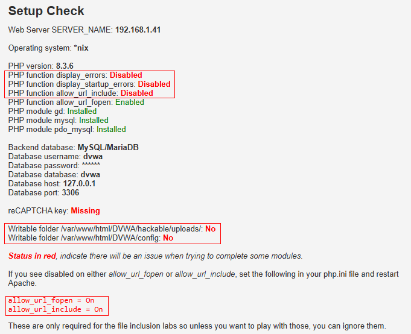
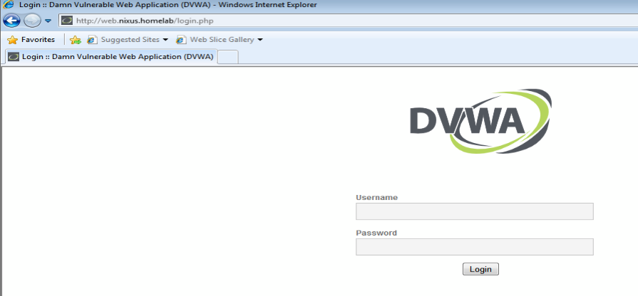

# Part 3: Ubuntu Server Setup and DVWA Installation

After setting up Active Directory on Windows Server, we will now configure our Ubuntu server. Ubuntu Server is ideal for web applications, network services, and development platforms due to its flexibility, security, and extensive support. It complements Windows Server by providing an open-source Linux environment for additional server functionalities.

**Hardware Requirements**:  
- **2 processors**  
- **4 GB of RAM**  
- **30 GB of storage**  

**Ubuntu Server Installation Guide**: [YouTube Tutorial](https://www.youtube.com/watch?v=TvvxAPbgT8w)

---

## 1. SSH Setup

To simplify command execution and allow for copy-paste functionality, we'll SSH into the Ubuntu server from the host machine.

### Steps:
1. Install the OpenSSH server (if not already installed):

    ```bash
    sudo apt install openssh-server
    sudo systemctl start ssh
    sudo systemctl status ssh
    sudo ufw allow ssh
    ```

2. Find the server's IP address:
   
    ```bash
    ip a
    ```

3. SSH from the host machine (replace `user` and `ip` with your server details):

   ```bash
    ssh user@ip
    ```

   Example:

    ```bash
    ssh nixus@192.168.1.41
    ```

---

## 2. DVWA Installation

DVWA (Damn Vulnerable Web Application) is a PHP/MySQL-based web application designed for testing security tools and practicing penetration testing skills.

For detailed installation instructions, refer to the [DVWA GitHub README](https://github.com/digininja/DVWA/blob/master/README.md).

### Installation Steps:
1. **Update and install essential packages**:

    ```bash
    sudo apt-get update
    sudo apt install -y apache2 mariadb-server mariadb-client php php-mysqli php-gd libapache2-mod-php nano unzip fping
    ```

2. **Clone the DVWA repository**:

    ```bash
    cd /var/www/html
    sudo git clone https://github.com/digininja/DVWA.git
    ```

---

## 3. Network Configuration

Now that we've completed downloading the essential packages, we can configure the network interface to VLAN20 in order to connect to our corporate LAN. To achieve that, follow the steps below:

### Steps:
1. Create a new Netplan configuration file:

    ```bash
    sudo nano /etc/netplan/01-network-config-01.yaml
    ```

2. Add the following configuration:

    ```yaml
    network:
        version: 2
        renderer: networkd
        ethernets:
            ens33:
                addresses:
                    - 10.0.20.10/24
                nameservers:
                    addresses: [10.0.20.254]
                routes:
                    - to: default
                      via: 10.0.20.254
    ```

3. Apply the configuration and verify:

    ```bash
    sudo netplan apply
    ip a
    ```

---

## 4. Apache Web Server Test

1. **Start the Apache server**:

    ```bash
    sudo service apache2 start
    ```

2. **Visit** `http://10.0.20.10` in your browser to confirm Apache is running.


---

## 5. DVWA Setup

1. **Configure DVWA**:

    ```bash
    cd /var/www/html/DVWA
    sudo cp config/config.inc.php.dist config/config.inc.php
    sudo nano config/config.inc.php
    ```
    Change the password in the configuration file to make it easier to write (`p@ssw0rd` -> `password`).

2. **Start the MariaDB service**:

    ```bash
    sudo service mariadb start
    ```

3. **Access the DVWA setup page** at `http://10.0.20.10/DVWA/setup.php` and click "Create / Reset Database".

4. **If you encounter an error**, it’s likely because you cannot use the MariaDB root user for database operations. To resolve this, you must create a new database user. Follow the steps below to create a user with the necessary permissions:

    1. Connect to the MariaDB database as the root user:
   
        ```bash
        sudo mariadb
        ```

    2. Run the following commands to create the database and user, and grant the necessary permissions:
    
        ```bash
        CREATE DATABASE dvwa;
        CREATE USER 'dvwa'@'localhost' IDENTIFIED BY 'password';
        CREATE USER 'dvwa'@'%' IDENTIFIED BY 'password';
        GRANT ALL ON dvwa.* TO 'dvwa'@'localhost';
        GRANT ALL ON dvwa.* TO 'dvwa'@'%';
        FLUSH PRIVILEGES;
        EXIT;
        ```

       **Note:** We create two user entries for `dvwa` to handle different connection types. The `dvwa@localhost` user allows access when connecting locally from the server where MariaDB is installed. This is more secure for internal processes. The second user, `dvwa@'%'`, allows access from any external IP address, supporting remote access needs. This way, we ensure that the database can be accessed both locally and from other machines on the network if needed.


5. **Restart Apache**:

    ```bash
    sudo service apache2 restart
    ```

Now, when you click on "Create / Reset Database" again, you should be redirected to the login page.


---

## 6. Configure DVWA Security Level

1. **Log in with default credentials** (`admin` / `password`).
2. **Set security level to "low"** under "DVWA Security".
3. To make it even more unsecure, we will allow remote connections to the database. Edit the file /etc/mysql/mariadb.conf.d/50-server.cnf and change the bind-address from 127.0.0.1 to 0.0.0.0.

    ```bash
    #bind-address = 127.0.0.1
    bind-address = 0.0.0.0
    ```
---

## 7. PHP Configuration

Visit `http://192.168.1.41/DVWA/setup.php` and address the remaining setup warnings as indicated by the red text.



### Steps:
1. **Open the PHP configuration file**:
   For most Linux systems, it's found at `/etc/php/x.x/apache2/php.ini`. For my case, it was `/etc/php/8.3/apache2/php.ini`.

    ```bash
    sudo nano /etc/php/8.3/apache2/php.ini
    ```

2. **Ensure PHP shows all error messages**:

    ```ini
    display_errors = On
    display_startup_errors = On
    ```

3. **Allow Remote File Inclusions (RFI)**:

    ```ini
    allow_url_include = On
    allow_url_fopen = On
    ```

4. **Update file permissions** for uploads and config:

    ```bash
    sudo chmod 777 /var/www/html/DVWA/hackable/uploads/
    sudo chmod 777 /var/www/html/DVWA/config
    ```

5. **Restart Apache**:

    ```bash
    sudo service apache2 restart
    ```

6. **Verify** the setup:
    After completing these steps, you should see the configuration page working as expected.


---

## 8. DNS Configuration (Optional)

To simplify access, configure a DNS entry for `web.nixus.homelab` to point to the server's IP.

### Steps:
1. **Copy and edit the Apache configuration file**:

    ```bash
    cd /etc/apache2/sites-available
    sudo cp 000-default.conf web.nixus.homelab.conf
    sudo nano web.nixus.homelab.conf
    ```

2. **Add the following content**:

    ```apache
    <VirtualHost *:80>
        ServerName web.nixus.homelab
        ServerAdmin nixus@homelab
        DocumentRoot /var/www/html/DVWA
        ErrorLog ${APACHE_LOG_DIR}/error.log
        CustomLog ${APACHE_LOG_DIR}/access.log combined
    </VirtualHost>
    ```

3. **Enable the new configuration**:

    ```bash
    sudo a2ensite web.nixus.homelab.conf
    sudo a2dissite 000-default.conf
    sudo systemctl restart apache2
    ```

4. **On your host machine (Windows 10), edit the hosts file**:
    - Copy `C:\Windows\System32\drivers\etc\hosts` to your desktop.
    - Add this line:
      ```
      10.0.20.10 web.nixus.homelab
      ```
    - Replace the original file and flush DNS:
      ```cmd
      ipconfig /flushdns
      ```

Now, you should be able to access DVWA using the DNS hostname `http://web.nixus.homelab/`.


---

## 9. Access from Active Directory Machines (Optional)

1. **Ping the Web Server**:
   Ping the web server's IP (10.0.20.10) from an Active Directory host. If successful, you can access DVWA at `http://10.0.20.10/`.

2. **Create a DNS Record**:
   Create a DNS record to allow AD devices to resolve the hostname.


3. **Access DVWA via Hostname**:
   Once the DNS record is created, you should be able to access DVWA using the hostname `http://web.nixus.homelab/`.



---


## Conclusion

By following these steps, you've successfully set up an Ubuntu server, installed DVWA for penetration testing, and configured your network and DNS settings. This environment provides a great platform to practice web security, test security tools, and enhance your skills in ethical hacking.

In the next part, we will configure our **fake WAN** and set up **Kali Linux** to perform penetration testing and attacks on our DVWA environment.
