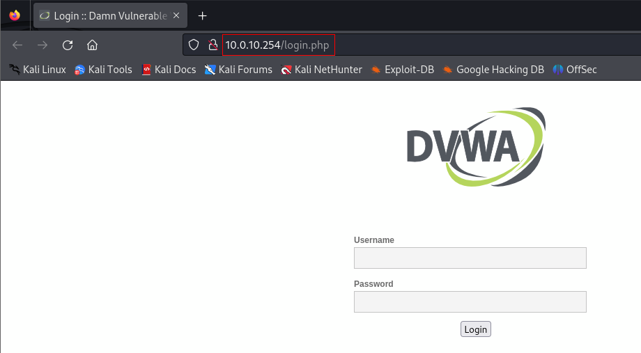
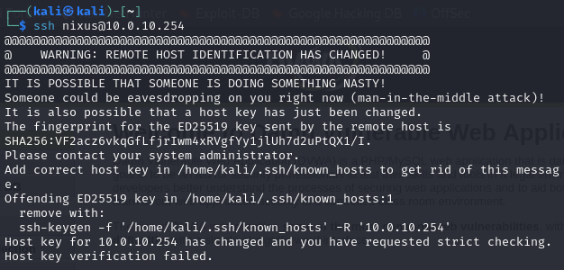

# Part 4: Configuring and Deploying Our Corporate WAN

In this guide, we’ll focus on setting up a simulated external network, which will serve as the source of potential threats in our security lab. This network will contain a Kali Linux machine, which we will use to simulate attacks that we’ll later detect with a SIEM system. Let’s get started!

---

### Step 1: Download and Import Kali Linux VM
1. Download the [Kali Linux](https://www.kali.org/get-kali/#kali-virtual-machines) VM that matches your requirements (e.g., VMware or VirtualBox).  
2. Import the downloaded VM into your virtualization software (VMware or VirtualBox). Use the **default configuration settings**:  
   - **4 GB of RAM**  
   - **2 processors**  
   - **80 GB of storage**  
   - Set the network mode to **NAT** or **Bridge**.  
3. Start the machine and log in.

---

### Step 2: Update and Upgrade
Run the following commands to update and upgrade the system:

```bash
sudo apt update
sudo apt upgrade
```

Once the update and upgrade processes are complete, shut down the VM.

---

### Step 3: Configure our Corporate WAN network:
1. In VMware, change the network adapter for the Kali machine to `Vmnet10` (VLAN 10).
2. Start the VM, then navigate to **Settings > Advanced Network Configuration**.
3. Double-click on **Wired Connection 1**, go to the **IPv4** tab, and set the IP, mask, and gateway as shown below:
   
   - IP Address: `10.0.10.254`
   - Subnet Mask: `255.255.255.0`
   - Gateway: `10.0.10.254`


4. Save the settings and verify the configuration by running:

   ```bash
   ifconfig

   ```
At this point, we will create a snapshot of our VM to have it always as a backup in case something breaks.

---

### Step 4: Firewall Configuration

In our simulated network setup, the Kali machine is treated as part of the external network, despite running locally in the lab environment. In a real-world scenario, multiple firewalls, routers, and devices would be positioned between the external network and internal resources. For simplicity, we'll assume the Kali machine is part of the external network.

To enable external access to internal services like HTTP, SSH, and MySQL, we'll configure port forwarding on the firewall.

#### Steps:

1. **Log in to your firewall** and navigate to **Firewall > NAT > Port Forward**.
   
2. **Create the following port forwarding rules**:
   - **Port 80 (HTTP)**: Forward traffic from the WAN VLAN 10 interface to the internal Linux server IP (10.0.20.10) on port 80.
   - **Port 3306 (MySQL)**: Forward traffic from the WAN VLAN 10 interface to the internal Linux server on port 3306.
   - **Port 22 (SSH)**: Forward traffic from the WAN VLAN 10 interface to the internal server on port 22.


---

### Step 5: Test Connectivity
Finally, let's test the connectivity between the Kali machine and the internal network.

Try to open the website from the browser, by opening `http://10.0.10.254`. You should be able to see the DVWA home page.



Next, test SSH access to the server by running:
   
   ```bash
   ssh nixus@10.0.10.254
   ```

Note: I initially encountered an issue when trying to SSH into the server. The SSH connection failed because of a misconfiguration in port forwarding, which caused the traffic to be forwarded to pfSense instead of the Linux server. After identifying the issue, I still encountered this warning:



This warning occurs because your SSH client has detected a different host key than the one previously associated with the IP address 10.0.10.254. When you added the port forwarding rule in pfSense, SSH traffic to 10.0.10.254 is now being forwarded to the web server on 10.0.20.11, which has a different SSH host key.

**To resolve this :**

1. Remove the Old Host Key: You’ll need to delete the old SSH key for 10.0.10.254 from your known hosts file so that the SSH client will trust the new forwarded connection:

   ```bash
   ssh-keygen -f "/home/kali/.ssh/known_hosts" -R "10.0.10.254"
   ```

2. Reconnect:** Try connecting again with:

   ```bash
   ssh nixus@10.0.10.254
   ```
Now you can see it's working.


And for the end, we can test MariaDB connection. 
To test the MariaDB connection, we need to configure the server to allow remote connections:
1. allow remote connections to the database. Edit the file `/etc/mysql/mariadb.conf.d/50-server.cnf` and change the bind-address from `127.0.0.1` to `0.0.0.0`.
   
   ```bash
   #bind-address = 127.0.0.1
   bind-address = 0.0.0.0
   ```
   
3. **Restart mariadb service:** After making changes to the configuration file, restart the MariaDB service to apply the updates:

   ```bash
   sudo systemctl restart mariadb
   ```

Now, we can verify that the connection is working by using the command  `mysql -u your-user -h server-ip -p`.

   

---

## Conclusion
In this guide, we successfully set up a simulated external network using Kali Linux, configured firewall rules for secure communication, and tested connectivity to internal resources. This setup provides a foundation for simulating security threats and detecting them with a SIEM system.

In the **next part**, we will install and configure **Security Onion**, a popular all-in-one SIEM solution. This tool will allow us to monitor network traffic and detect security incidents in real time, providing insights into potential threats and vulnerabilities.

