# Part 5: Security Onion Installation and Configuration Guide

Security Onion is a Linux distribution built for network security monitoring (NSM). It provides a centralized system for network analysis with pre-configured tools, saving you considerable time compared to setting up these tools manually. Some of the key tools in Security Onion include Suricata for IDS/IPS functionality and the ELK stack for SIEM and log management.

## Prerequisites

1. **Firewall VM (pfSense)**: Make sure your pfSense firewall VM is powered on.
2. **Internet Access**: Add bridged network to ensure there’s internet access, as Security Onion will require internet during installation to download certain packages.
3. **Create VLAN 88**: This VLAN will be used later for port mirroring (SPAN) to capture network traffic. We'll set this up in the guide.

## Installation Steps

### 1. Download the ISO

   - Download the Security Onion ISO file from [this link](https://github.com/Security-Onion-Solutions/securityonion/blob/master/VERIFY_ISO.md). In this example, we’re using the **2.3.300-20240401** ISO image built on **2024/04/01**.

   - Ensure your system meets the minimum requirements for Security Onion standalone mode. These include:

     - **RAM**: 16 GB.
     - **Processors**: 2 processors with 2 threads each (4 threads total).
     - **Hard Disk**: 200 GB.  
     
   For more details, refer to the [official hardware requirements](https://docs.securityonion.net/en/2.4/hardware.html).

### 2. Create a New VM

   - Create a new virtual machine in VMware (or a similar hypervisor).
   - Use **Ubuntu CentOS 7 64-bit** as the distribution.
   - Configure your VM as shown in the picture below:

   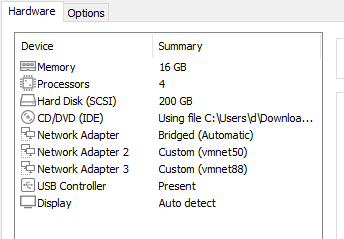
     
### 3. Note the MAC Addresses of Your Network Adapters

   - In VMware, go to **Network Adapter > Advanced** and generate a MAC address for each network adapter. You will need these later to identify which adapter is assigned to which VLAN during installation.
     - Example:
       - **Bridged**: `00:0C:29:26:BA:88`
       - **Vmnet 50**: `00:0C:29:26:BA:92`
       - **Vmnet 88**: `00:0C:29:26:BA:9C`

### 4. Power on the VM and Begin Installation

   - Power up the VM. On the initial screen, select **Install Security Onion 2.4.10 in basic graphics mode**.

     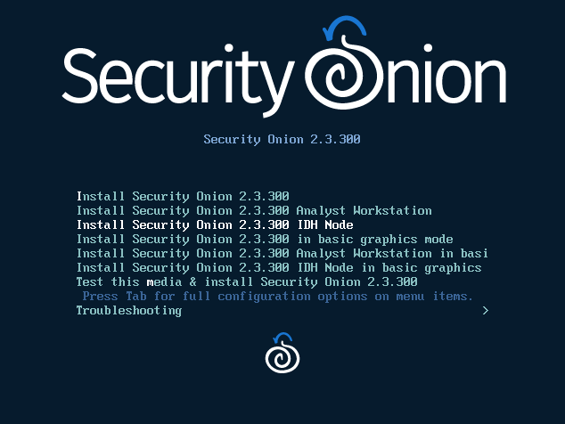
     
   - Follow the prompts:
     - Type "yes" when prompted.
     - Create a username and password for your Security Onion user.
    
     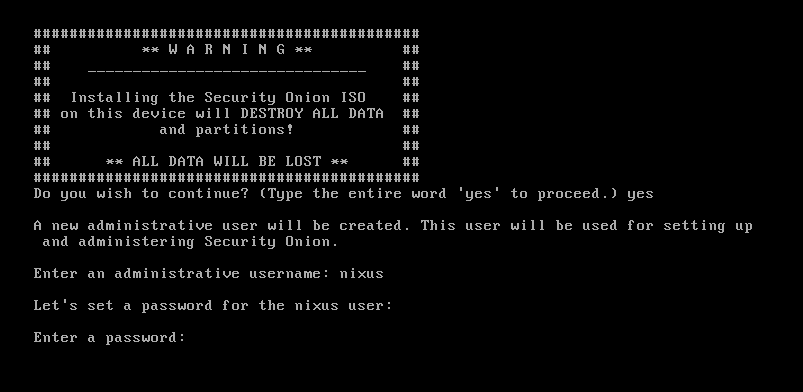

### 5. Primary Installation Process

   - After rebooting, log in to your VM console using the credentials you just set up. This will start the primary installation process.
   - **Choose Installation Type**: When prompted to choose an installation type, select **STANDALONE**.

   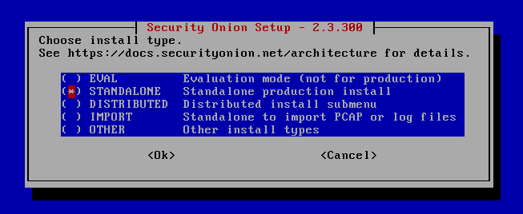

### 6. Configure the Hostname and Description

   - **Hostname**: Enter a hostname for your machine (e.g., `nixus-siem`). This is just the hostname, not the Fully Qualified Domain Name (FQDN); we’ll configure the FQDN later.
   - **Description**: Enter a description or simply press Enter to skip.

   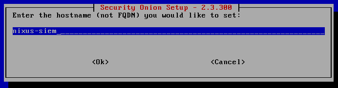
   
### 7. Setting Up Network Interfaces

   - **Management NIC**: Choose which network interface will be used for management (communication with other devices and IP assignment). Use the adapter on **Vmnet50** (compare the MAC address here with the one noted earlier).
   
   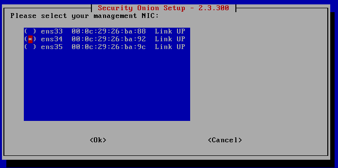

   - **IP Configuration**:
     - Choose **STATIC** for the management interface IP.
     - Enter a static IP address within the VLAN 50 range, as this will be the primary IP for managing Security Onion.

     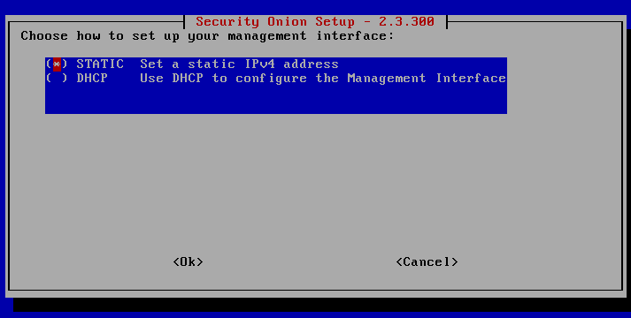
     
     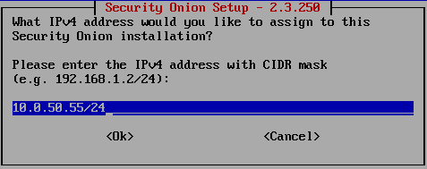
     
   - **Gateway and DNS**:
     - Set the gateway to the IP of pfSense on VLAN 50.
     - Set the DNS server to the pfSense IP as well.
     - Use your domain search suffix (e.g., `nixus.homelab`).

      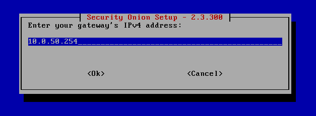
     
      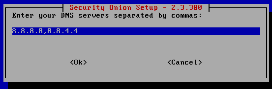
     
      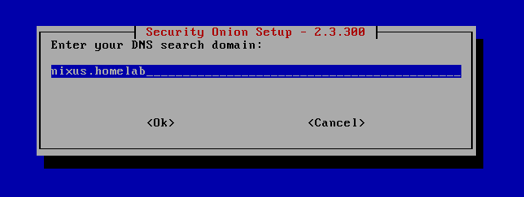

### 8. Set Up Connection and Installation Type

   - **Internet Connection**: Select **Standard** for the installation type and **Direct** as the method to connect to the internet.
   
   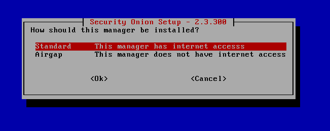
   
   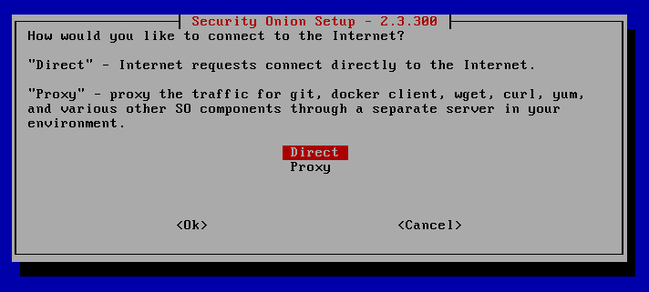

### 9. So-preflight Script Failed Checking

   - If you encounter an issue like the one shown in the picture below, don't worry—it doesn't affect the installation. Simply click **Continue**.
   
   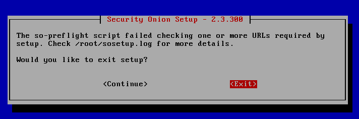

### 10. Configuring Monitor Interface

   - The monitor interface captures network traffic (SPAN/port mirroring) and will not be assigned an IP address.
   - Select **Vmnet88** as your monitor interface by pressing space to select it.

   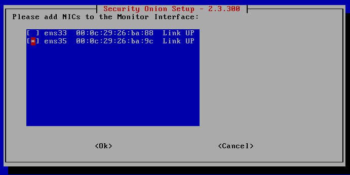

### 11. Default Settings and Zeek/Suricata Selection

   - Continue through the default settings until you reach the IDS/IPS tool choice. Choose **Zeek**.

     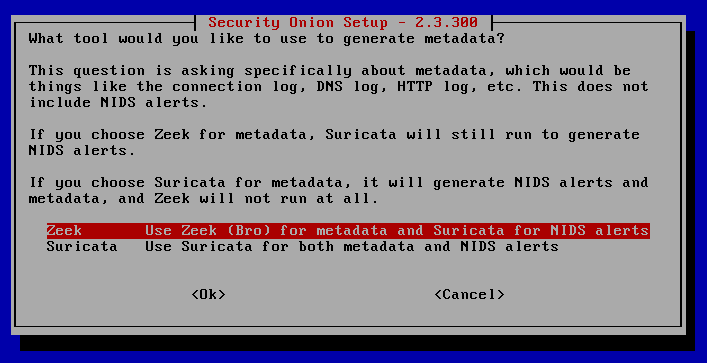

### 12. SOC Console User

   - Set up a SOC Console user with an email and password. This user will be used to log in to the Security Onion Console.

   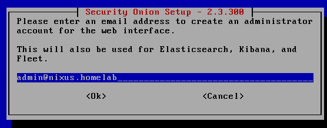

### 13. Configure Web Interface Access

   - For web interface access, select **IP**.

   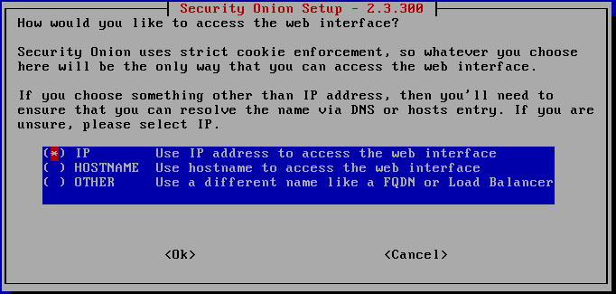

   - Keep the default configuration until you reach the step where you are asked if you want to run **so-allow** to allow other machines to access the web interface. Click **No**, as we will configure this later after the installation is complete.

   

### 14. Finalize Configuration

   - Review the final configuration summary. If everything looks correct, select **Yes** to start the installation process. This step will take some time.

   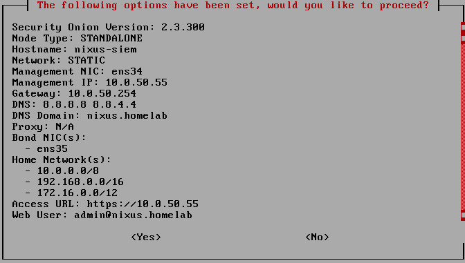

   - **Note**: In my case, the installation took around **8 hours**. The duration may vary depending on your hardware and internet speed. If you notice that the installation appears to be stuck, don't worry—this is normal. Just let the process complete.

### 15. Completion

   - Once the installation completes and the VM reboots, you should see something like this:

   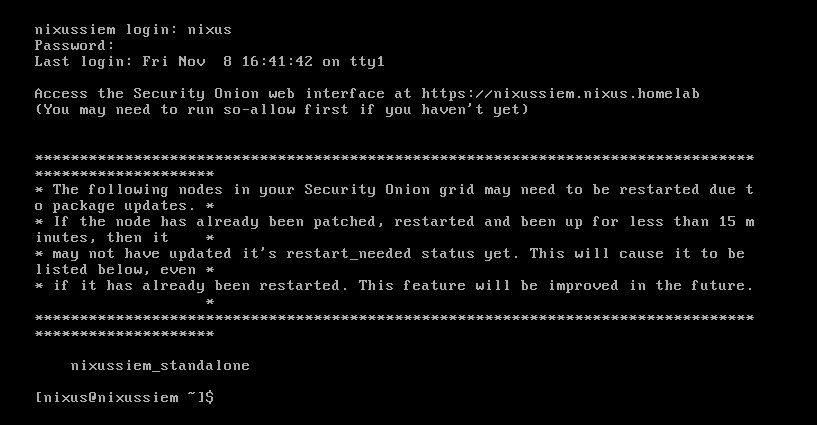

---

# Security Onion Configuration

After establishing an SSH connection to our Security Onion instance, we need to configure the web interface access. This involves specifying an IP address or a range of addresses allowed to connect to the interface.

## Allowing Access
1. To allow access, execute the following command:  
   ```bash
   sudo so-allow
   ```
   - Choose option "a" for an analyst role.
   - Enter the IP address or IP pool allowed to access the interface.
     In this case, the host IP on VLAN50, 10.0.50.1, was used.

     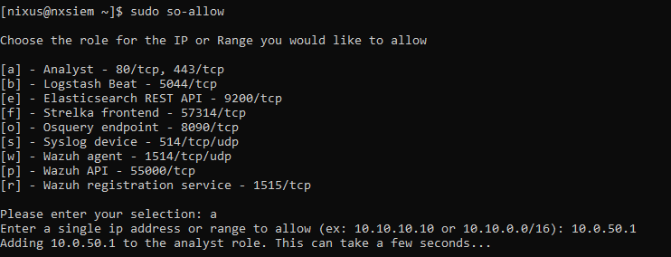

2. Verify Services
   Before accessing the web interface, ensure all Security Onion services are running:
   ```bash
   sudo so-status
   ```
   Services may take some time to start. Wait until they are all active, as shown below:

   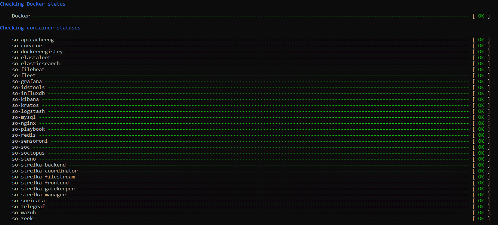

3. Access the Web Interface
Once services are running, use the machine's IP (e.g., http://10.0.50.55) to access the interface.
   - Click "Advanced" and then "Proceed to 10.0.50.55 (unsafe)".

4. Log In
   - Use the email and password set up during the installation to log in.
  
     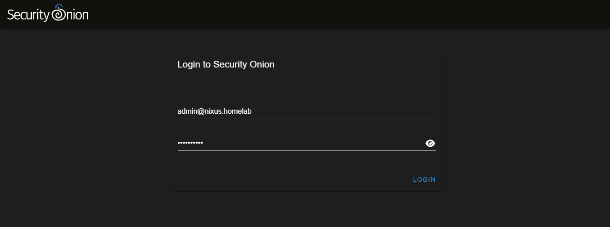
     
## pfSense Configuration
To monitor network traffic using Security Onion, configure port mirroring on the pfSense firewall.

- What is Port Mirroring?
  Port mirroring allows the duplication of all network traffic received by one network interface and forwards it to another interface. This helps monitor traffic without affecting the network flow.

- Configuration Steps
  1. Add and Assign the SPAN Port Interface
     - Add a new interface to the firewall.
     - Navigate to Interfaces > Assignments, and assign a name like SPAN_PORT to the interface. No IP address is needed.

      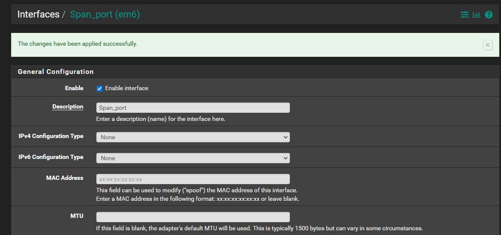

   2. Create a Bridge
      - Go to Interfaces > Assignments > Bridges and click Add to create a new bridge.
      - In the bridge configuration:
         - Select VLAN 20 as the monitored traffic.
         - In Advanced Options, set VLAN 88 (SPAN_PORT) as the interface receiving the mirrored traffic.

      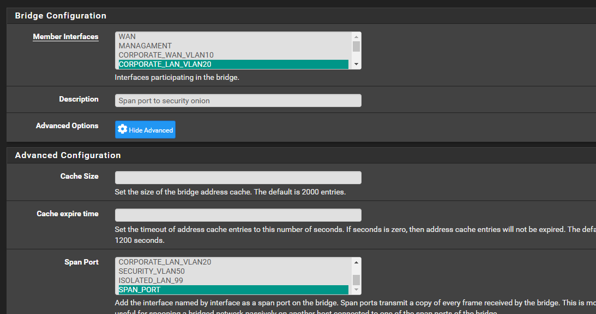

---

## Basic Testing
To ensure the setup works, test packet capturing using a Kali Linux machine and a web server (e.g., DVWA).

### Test Commands
Ping Test:
`ping 10.0.10.254`, this generates low-severity alerts:
- GPL ICMP_INFO PING *NIX
- GPL ICMP_INFO PING BSDtype

Nmap Scan:
`nmap -sC -sV -n -v 10.0.10.254`, this raises several alerts of varying severity:
- ET SCAN Nmap Scripting Engine User-Agent Detected
- ET SCAN Possible Nmap User-Agent Observed
- ET SCAN Suspicious inbound to MySQL port 3306

SQLMap Scan:
`sqlmap -u "http://10.0.10.254/"` simple sqlmap scan that will probably fail but the scan attempt will still be detected : 
- ET SCAN Sqlmap SQL Injection Scan
- ET SCAN suspicous inbound to mySQL port 3306

### Viewing Alerts
Navigate to the alerts section in Security Onion to view generated alerts:

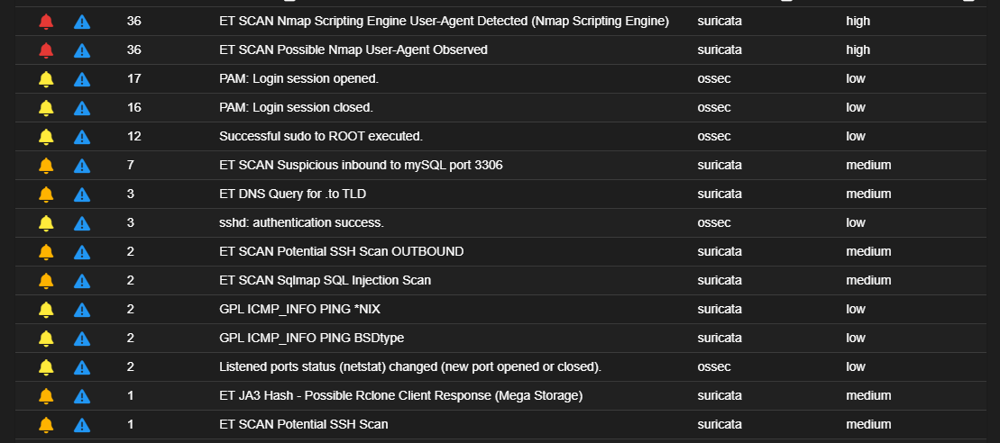

### Suricata Role in Detection
All previous alerts were detected by Suricata, a network-based intrusion detection system. It uses default rules to classify actions with severity levels. Custom rules can also be added. While Security Onion uses Suricata by default, we will switch to Snort for the next steps as it aligns better with the web server attacks we will simulate.

---

## Conclusion
With the successful installation and configuration of Security Onion, we now have a centralized network security monitoring system in place.

The next step is to implement **Wazuh HIDS**, integrated with Security Onion, to monitor and analyze logs from our Active Directory environment. This will enhance our ability to detect and respond to security threats effectively.
