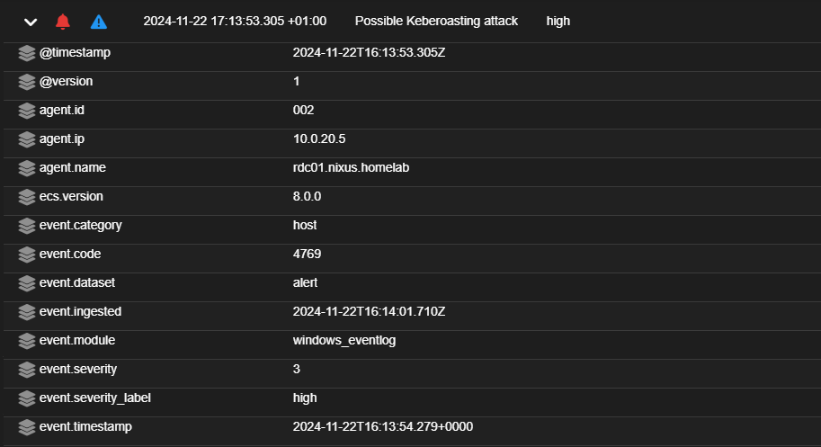

# Part 6: Building Host-based Intrusion Detection Systems (HIDS) for Active Directory Machines Using Wazuh and Security Onion

In the previous part, we installed and configured Security Onion. 

**Note**: In that part, we configured Security Onion to have the IP address **10.0.50.55**. However, due to issues with the machine, I deleted it and set up a new one with the IP address **10.0.50.100**. Please make sure to replace the IP **10.0.50.100** with the correct IP **10.0.50.55** in the steps below.

Now, we will use a tool from Security Onion called **Wazuh**.

**Wazuh** is a powerful **Host-Based Intrusion Detection System (HIDS)** that continuously monitors systems for suspicious activity, security threats, and policy violations. It collects and analyzes log data to provide real-time alerts, helping to detect and respond to security incidents efficiently.

---

## Conigure Static Routing
To enable endpoint devices in Active Directory to route traffic through the Domain Controller (DC) and establish communication with the SIEM (Security Onion), we need to set up static routing on the Domain Controller :
- Open **Server Manager** > **Tools** > **Routing and Remote Access**. 
- Right-click your server and select **Configure and Enable Routing and Remote Access**, choosing **LAN Routing**.
- In **IPv4 > Static Routes**, add a route pointing to the future SIEM server's IP address.
  


---

## Firewall Changes

1. The first step is to allow Wazuh traffic from the agents to the Security Onion Wazuh Manager. On the Security Onion machine, run the following command:

  ```bash
  so-allow
  ```

  - Select option **W** and add the VLAN 20 network, then press Enter.
  - Repeat the process for option **R** (Wazuh registration service).
  
  

2. Next, allow Wazuh **TCP/UDP** traffic on ports **1514-1515** on your pfSense firewall:
  - Navigate to **Firewall > Rules > CORPORATE_LAN_VLAN20**.
  - Create a rule to allow TCP/UDP traffic in the port range 1514-1515 toward the SIEM IP address.
  
  
  
---

## Deploying Wazuh Agents
Before installing agents on the virtual machines (VMs), they need to be registered in the Security Onion (SO) Wazuh Manager.

1. On the Security Onion machine, run:

  ```bash
  so-wazuh-agent-manage
  ```

2. Choose Option A to add a new agent.
3. Provide the required details:
  - Hostname: Specify a name for the VM.
  - IP Address: Enter the VM's IP address.

For example, in this setup:
  - A domain controller (Active Directory machine) was added.
  - Two endpoints: Windows 7 and Windows 10 were added.
  
  

  

---

## Installing Sysmon and Wazuh Agent

### Sysmon
1. Download Sysmon from the [Microsoft Sysinternals website](https://learn.microsoft.com/en-us/sysinternals/downloads/sysmon).
2. Download the Sysmon configuration file, `sysmonconfig-export.xml`, from this [GitHub repository](https://github.com/Neo23x0/sysmon-config).
3. Transfer the files to the Domain Controller and share them with endpoints using shared folders.
4. Extract Sysmon.zip and run CMD as Administrator. Navigate to the folder containing Sysmon and the configuration file, then execute:
  
  ```bash
  sysmon64.exe -accepteula -i sysmonconfig-export.xml
  ```

  

### Wazuh

1. Download the Wazuh agent from [Wazuh's official documentation](https://documentation.wazuh.com/current/installation-guide/wazuh-agent/wazuh-agent-package-windows.html).

2. Transfer the installer to all machines and install it, then run Wazuh agent.

   

3. Configure the Wazuh agent:
  - On the wazuh Agent, set the Security Onion IP address as the Manager IP.
  - From security Onion CLI retrieve the authentication key for each machine:

  ```bash
  so-wazuh-agent-manage
  ```

  - Choose Option E and select the machine to extract its authentication key.

  

  - Enter the authentication key into the Wazuh Agent Manager, save the configuration, and start the agent.

  

**Note :** You can verify successful connection by checking the hostname and ip in the Wazuh Agent Manager interface.

### Adding Sysmon Logs to Wazuh
1. Open the Wazuh Agent Manager and navigate to **View > View Config**.

2. Add the following block after the last `<localfile>` section in the config file:

  ```yaml
  <localfile>
    <location>Microsoft-Windows-Sysmon/Operational</location>
    <log_format>eventchannel</log_format>
  </localfile>
  ```

  

3. Save the file and restart the agent service.

### Verifying Agent Connection
To verify everything is working, open the Wazuh Agent Manager and navigate to **View > Logs**. Ensure the machine is successfully connected to the Security Onion Wazuh Manager.

**Troubleshooting**:  
In my case, I encountered an error where the machine could not connect to the Security Onion manager on TCP port 1514, despite everything being configured correctly. 


To resolve this, I switched to the UDP protocol:  
1. Navigate to **View > View Config** in the Wazuh Agent Manager.  
2. Change the protocol from `tcp` to `udp` in the configuration.  
3. Save the changes and restart the agent.  


This resolved the issue, and the machine connected successfully.
Now, if we go to **Security Onion > Alerts**, we can see that logs from our machines are being received.


**Note:**  
Repeat these steps for all three endpoints to ensure proper configuration and logging.

---

## Simulating Active Directory Attacks
We will simulate three common Active Directory attacks:

1. **DCSync Attack:** An attacker mimics a Domain Controller to request and steal password hashes from Active Directory. This allows them to crack passwords for privileged accounts.
2. **Golden Ticket Attack:** An attacker forges a Kerberos ticket using the KDC's secret key, allowing them to impersonate any user and gain unauthorized access to the network.
3. **Kerberoasting Attack:** An attacker requests service tickets for service accounts in Active Directory and cracks them offline to obtain the passwords, often targeting accounts with weak passwords.

Follow this blog for detailed steps: [Detecting AD Attacks with Wazuh](https://wazuh.com/blog/how-to-detect-active-directory-attacks-with-wazuh-part-1-of-2/?fbclid=IwY2xjawGsaShleHRuA2FlbQIxMAABHWGjGjY8zd4yUI8DD928kpxxIcXubEDkx-aPQegRLsJmk3HIC7kZxtKUtQ_aem_nnG51h4_n9NKGBm0aBg4wA).

**Notes:**
- A CentOS endpoint is not required as Wazuh is already installed in Security Onion.
- Sysmon and Wazuh are configured on all endpoints.
- To add a user with local admin privileges, refer to this . [YouTube guide](https://www.youtube.com/watch?v=U5CxThmqzl8&list=LL&index=1&ab_channel=Eng.MahmoudEnan)
- Grant "Replicating Directory Changes" permissions following this guide: [Grant Permissions](https://learn.microsoft.com/en-us/troubleshoot/windows-server/windows-security/grant-replicating-directory-changes-permission-adma-service)
- Create a service account on Active Directory using:

  ```powershell
  New-ADUser -SamAccountName "Test-Svc" -UserPrincipalName "Test-Svc@nixus.homelab" -Name "Test-Svc" -GivenName "Test" -Surname "Svc" -DisplayName "Test-Svc" -Enabled $true -AccountPassword (ConvertTo-SecureString "nixuspassword" -AsPlainText -Force) -PasswordNeverExpires $true -CannotChangePassword $true
  setspn -A http/Windows10 Test-Svc
  setspn -L test
  ```

- Since we are using Security Onion, you can't add Wazuh rules to `/var/ossec/etc/rules/local_rules.xml`. By referring to the [Security Onion cheat sheet](https://docs.securityonion.net/en/2.4/cheat-sheet.html), we found that the correct file for Wazuh custom rules is `/opt/so/rules/hids/local_rules.xml`. Therefore, we can add the local rules directly to this file and then restart the Wazuh service from security onion CLI using the command:

  ```bash
  sudo so-wazuh-restart --force
  ```

- The purpose of adding these rules is to ensure that when Wazuh receives events related to the attacks you are performing, it does not mistakenly detect them as attacks. Instead, these rules clarify the events for the Wazuh manager, allowing it to recognize and correlate similar events based on the custom rules. This helps in accurately detecting and managing attacks that align with the rules we created.

  Restart the Wazuh service with:
  
  ```bash
  sudo so-wazuh-restart --force
  ```

### Verification
After simulating the attacks, if we check the Security Onion alerts, we can see the three attacks we performed, all marked with high severity.


Now lets observe the details of one of the events, click on an event then click **drilldown**.


   
Let’s take a look at the details of the event labeled "Possible Kerberoasting Attack". It includes the following information:
  - Event Time: The timestamp of the detected attack.
  - Wazuh Agent Information: Details about the Wazuh agent that captured this log.
  - Attacking Machine Information: Data about the machine simulating the attack.
  - User Information: The user account that launched the attack.
  - Target Information: Details about the service account targeted in the attack.




---

## Conclusion
We successfully deployed Wazuh as a Host-Based Intrusion Detection System (HIDS) integrated with Security Onion, enabling effective monitoring of Active Directory machines. By setting up Wazuh agents, configuring Sysmon, and simulating common Active Directory attacks, we verified Wazuh's ability to detect threats such as DCSync, Golden Ticket, and Kerberoasting attacks.

In the next step, we will explore another popular SIEM solution by integrating **Snort NIDS** with **Splunk** to monitor and detect attacks targeting our DVWA web server.
