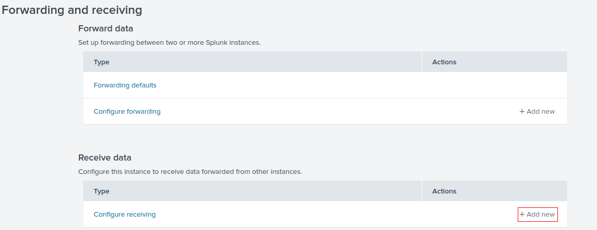
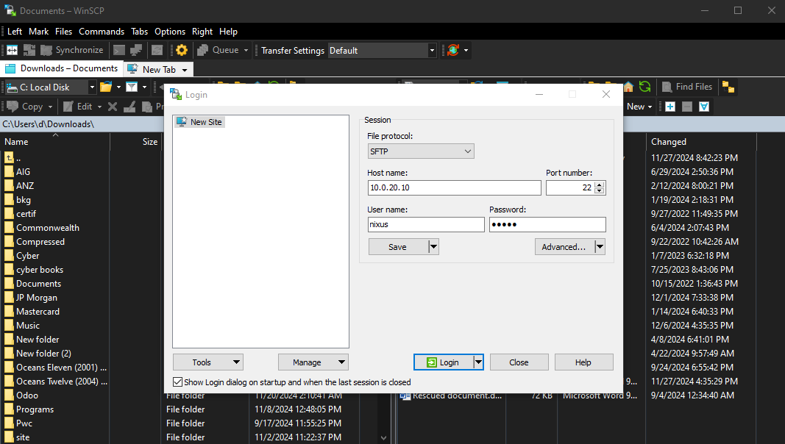
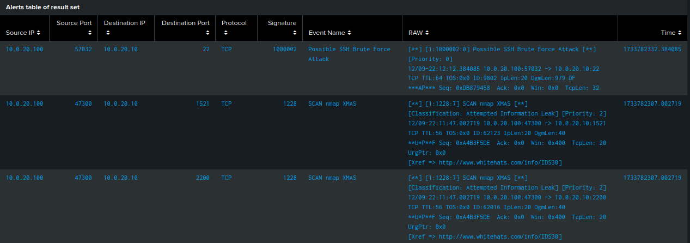

# Part 7: Building a Network-based Intrusion Detection System (NIDS) for DVWA Web Server using Snort and Splunk

In the previous section, we set up **Wazuh** as a Host-based Intrusion Detection System (HIDS) to monitor the **Active Directory**. For this step, we will shift our focus to analyzing attacks on our **DVWA (Damn Vulnerable Web Application)** server by building a **Network-based Intrusion Detection System (NIDS)** using **Snort** with **Splunk**.

### What is NIDS?

A **Network-based Intrusion Detection System (NIDS)** monitors network traffic for suspicious activity, such as exploitation attempts or unauthorized access. It inspects traffic that flows across the network to identify patterns that could indicate an attack.

### Why Link Snort with Splunk?

**Snort** is a popular open-source NIDS that can detect various types of attacks, including web-based threats targeting servers like DVWA. By linking **Snort** with **Splunk**, we can centralize and analyze Snort logs in real time. This integration allows for advanced searching, correlation, and alerting, helping us quickly identify and respond to attacks on the DVWA web server.

---

## Splunk Manager :
### Ubuntu Server Installation
1. **Set up the server:**
   - Allocate **4 GB of RAM**, **2 processors**, and **30 GB of storage** for optimal performance.  
   - Use two network adapters:  
     - NAT adapter for internet access.  
     - VLAN 20 adapter for private networking.  
   - Complete the installation process.
   
2. **Post-installation:**
   - Open the terminal and run the following command to install a GUI:
     ```bash
     sudo apt install ubuntu-desktop
     ```

   

### Downloading and Installing Splunk
1. Visit [Splunk Enterprise Download](https://www.splunk.com/en_us/download/splunk-enterprise.html).
2. Create an account and download the `.deb` installation file.

   
   
3. Accept the agreement and click "Access Program" to start the download.

   

5. Install Splunk:
   ```bash
   cd Downloads
   sudo dpkg -i splunk-9.1.2-b6b9c8185839-linux-2.6-amd64.deb
   ```

   

After the installation is completed, use the following command to launch Splunk:
```bash
sudo /opt/splunk/bin/splunk start --accept-license --answer-yes
```

Provide a name and password when prompted. These credentials will be used to log into Splunk.


Once the setup is complete, you will see that Splunk is running on `http://127.0.0.1:8000`.


Run the following to allow Splunk to start automatically when the system is booted:
```bash
sudo /opt/splunk/bin/splunk enable boot-start
```


Now to configure Splunk to receive data:
1. Go to **Settings > Add Data > Forwarding and Receiving**.

   
   
3. Scroll down to **Receive Data** and click **Add New**.

   
   
6. Enter **9997** as the port to listen for incoming data. Click **Save**.
  
   
   
---

## Snort installation and configuration
First, we need to add an internet connection to our server by adding a second adapter **NAT**. For my case, when I ran `ip a`, I found that the link was down. This means it is not yet activated or configured.
To bring it up (replace `ens37` with your NAT adapter interface name):
```bash
sudo ip link set ens37 up
```

Now, the link is up but not configured, so we need to go to `/etc/netplan/01-network-config-01.yaml` to modify the script and enable DHCP for our NAT adapter. Our file should look like this:
```yaml
network:
    version: 2
    renderer: networkd
    ethernets:
        ens33:
            addresses:
                - 10.0.20.10/24
            nameservers:
                addresses: [10.0.20.254]
            routes:
                - to: default
                  via: 10.0.20.254
                  metric: 200
        ens37:
            dhcp4: true
            routes:
                - to: default
                  via: 192.168.133.2
                  metric: 100
```

Now, apply the changes by running `sudo netplan apply`. Afterward, if we `ip a`, we should see that the server has been assigned an IP address.

At this point, we can ping both 8.8.8.8 and google.com to confirm that the server has a working internet connection.

Now let's install Snort:
```bash
sudo apt-get update && sudo apt-get dist-upgrade -y
sudo apt install build-essential libpcap-dev libpcre3-dev libnet1-dev zlib1g-dev luajit hwloc libdnet-dev libdumbnet-dev bison flex liblzma-dev openssl libssl-dev pkg-config libhwloc-dev cmake cpputest libsqlite3-dev uuid-dev libcmocka-dev libnetfilter-queue-dev libmnl-dev autotools-dev libluajit-5.1-dev libunwind-dev libfl-dev -y
sudo apt install snort
```

**Note:** During Snort installation, you will be prompted to define the network address range. For this setup, specify it as `10.0.20.0/24`.  


Once Snort is installed, disable the NAT adapter to remove internet access. DVWA is intentionally designed to be vulnerable, so if it's accessible from the internet, malicious actors could exploit these vulnerabilities.

For Snort configuration, we need to modify the file `/etc/snort/snort.conf`. It's highly recommended to create a backup of this file before making any changes, so you can revert to the original configuration if necessary:
```bash
sudo cp /etc/snort/snort.conf /etc/snort/snort_old_config.conf
```

Now, open the configuration file:
```bash
sudo nano /etc/snort/snort.conf
```

Scroll to the section marked as Step #1 and change the home network to our network (10.0.20.0/24).


After completing the configuration, we can test it by running:
```bash
sudo snort -T -i ens33 -c /etc/snort/snort.conf
```
- `-T` runs Snort in test mode.
- `-i` specifies the network interface in use.
- `-c` specifies the Snort configuration file and its location.

**Note**: Every time we make changes to the configuration, we should run this command to ensure there are no errors.

---

## Splunk Universal Forwarder
1. Download the universal forwarder to the host machine from the official Splunk page: [Universal Forwarder Download](https://www.splunk.com/en_us/download/universal-forwarder.html?locale=en_us).

2. Now, let's move it from our host machine to the web server using WinSCP ([download it from WinSCP](https://winscp.net/eng/download.php)).
   - Open WinSCP and enter the host IP, user, and password.
  
     
     
     **Note**: Ensure port 22 is open to access the Ubuntu server.
   - Navigate to the host's Downloads folder and to `/home/nixus` on the Ubuntu server.
   - Move the installer file from the left side (host machine) to the right side (Ubuntu server).
  
     

3. On the Ubuntu server, copy the installation file to `/opt` (requires root privileges):
   ```bash
   cd /home/nixus
   sudo cp splunkforwarder-9.3.2-d8bb32809498-linux-2.6-amd64.deb /opt
   ```
   
4. Following the Splunk documentation to install the universal forwarder:
[Universal Forwarder Installation Guide](https://docs.splunk.com/Documentation/Forwarder/9.3.2/Forwarder/Installanixuniversalforwarder#Install_on_Linux).

   - Create the Splunk user and group:
   ```bash
   useradd -m splunkfwd
   groupadd splunkfwd
   ```
   - Extract the installation file:
   ```bash
   cd /opt
   sudo dpkg -i splunkforwarder-9.3.2-d8bb32809498-linux-2.6-amd64.deb
   ```

5. Setup environment variables and permissions:
   ```bash
   cd ~
   export SPLUNK_HOME="/opt/splunkforwarder"
   chown -R splunkfwd:splunkfwd $SPLUNK_HOME
   ```

6. Switch to root to run Splunk:
   ```bash
   sudo su
   /opt/splunkforwarder/bin/splunk start
   ```
   - Keep pressing space to scroll down the license agreement.
   - Accept the agreement by tapping y and enter a username and password for the administrator account.

7. Add your Splunk IP and port to forward logs to:
   ```bash
   /opt/splunkforwarder/bin/splunk add forward-server 10.0.20.129:9997
   ```
   - Enter the universal forwarder username and password to validate the action.

8. Verify the configuration by opening the file:
   ```bash
   sudo nano /opt/splunkforwarder/etc/system/local/outputs.conf
   ```
   - Ensure it contains the following:
   ```yaml
   [tcpout]
   defaultGroup = default-autolb-group
   
   [tcpout:default-autolb-group]
   server = 10.0.20.129:9997
   
   [tcpout-server://10.0.20.129:9997]
   ```

9. Enable boot start for the universal forwarder so it will start automatically after boot:
   ```bash
   /opt/splunkforwarder/bin/splunk stop
   /opt/splunkforwarder/bin/splunk enable boot-start
   ```

10. Start the universal forwarder:
   ```bash
   /opt/splunkforwarder/bin/splunk start
   ```

11. Add the desired logs to Splunk:
   ```bash
   /opt/splunkforwarder/bin/splunk add monitor /var/log/snort/alert
   ```

12. Edit the inputs.conf file:
   ```bash
   sudo nano /opt/splunkforwarder/etc/apps/search/local/inputs.conf
   ```
   -Add the following:
   ```yaml
   [splunktcp://9997]
   connection_host = 10.0.20.129
   [monitor:///var/log/snort/alert]
   disabled = false
   index = main
   sourcetype = snort_alert_full
   source = snort
   ```

13. Restart Splunk:
   ```bash
   /opt/splunkforwarder/bin/splunk restart
   ```

---

## Launching the Attacks:
First, let's run Snort in `console` mode. This will display the alerts directly in the terminal without saving them to the alert file, allowing us to test the rules we're creating in real-time. Once we’ve tested and refined the rules, we’ll switch to Snort's `full` mode.

`Full` mode is preferred over `fast` mode because it provides more comprehensive logging, including detailed packet data and complete event information, which are crucial for thorough analysis and troubleshooting.

To run Snort in console mode, use the following command:
```bash
snort -A console -i ens33 -c /etc/snort/snort.conf -q
```

### Hping3:
- `sudo hping3 --icmp --flood 10.0.20.10`: This command performs an ICMP flood on our web server. By default, Snort detects this as an ICMP Ping Nmap. We want to add a custom rule for this attack. Before that, let's check the default rule by using the command `grep -r "ICMP PING NMAP" /etc/snort/rules/`. We found that the rule exists in `icmp.rules`. However, we can see that the rule isn't exactly what we need, and while it is not ideal, we'll comment it out to avoid interference.
   We will then add the following rule for ICMP Ping Flood in `local.rules`:
   ```yaml
   alert icmp any any -> any any (msg:"Potential ICMP flood attack detected"; itype:8; threshold:type both, track by_dst, count 50, seconds 1; sid:1000001;)
   ```
   The reason I said it is not entirely accurate is that the new rule detects the attack based on a minimum number of packets received within a specified time (50 packets per second in our case). Now, test the configuration using:
   ```bash
   snort -T -i ens33 -c /etc/snort/snort.conf
   ```
   If no errors are shown, let's run Snort again using:
   ```bash
   snort -A console -i ens33 -c /etc/snort/snort.conf -q
   ```
   Now, let's perform the attack again. We should see something like this:

  

- `sudo hping3 --syn --flood -p 21 10.0.20.10`: This performs a SYN flood attack on our web server on port 21 (FTP in our case). By default, Snort doesn't detect this as a SYN attack, but it can be detected as `BAD-TRAFFIC tcp port 0 traffic [**] [Classification: Misc activity]` and `MISC Source Port 20 to <1024 [**] [Classification: Potentially Bad Traffic]`.
Let's add the following rule to `local.rules`:
   ```yaml
   alert tcp any any -> any 21 (msg:"Potential SYN flood attack detected on port 21"; flags:S; threshold:type both, track by_dst, count 20, seconds 1; sid:1000002;)
   ```
   After testing the configuration and running Snort again, we can verify that the rule can detect the attack.

   

### Nmap:
- `sudo nmap -sN -p22 10.0.20.10`: This command initiates a TCP Null Scan on port 22 of the target IP address (10.0.20.10). A Null scan sends TCP packets with no flags set, making it harder to detect.
  To detect such events targeting port 22 with no flags, we can add a custom rule. Below is the rule to identify this type of traffic:
   ```yaml
   alert tcp any any -> any 22 (msg:"Nmap Null Scan detected"; flags:0; sid:100003; rev:1;)
   ```
   After testing the configuration and running Snort, we can see that the events are detected successfully.

  
  
- `sudo nmap -sX 10.0.20.10`: This performs an Xmas scan, which is used to detect open, closed, and filtered ports by observing how the target responds to unusual TCP packets. Snort has a default rule to detect this scan.

   

### SSH Brute Force Attack:
- `hydra -l nixus -P wordlist.txt ssh://10.0.20.10`: This command performs a brute-force attack on the SSH service of our web server at 10.0.20.10, using the username `nixus` (you can use `-l username` if you already know the username or `-L user_list.txt` for a list) and testing passwords from the file `wordlist.txt` until the correct one is found. By default, there isn’t a Snort rule that detects this, so we will add the following rule to detect SSH login attempts within a specific time frame (for example, 5 attempts in 5 seconds):
   ```yaml
   alert tcp any any -> any 22 (msg:"Possible SSH Brute Force Attack"; flow:to_server,established; content:"SSH-2.0"; nocase; threshold:type both, track by_src, count 5, seconds 5; sid:1000002;)
   ```
   Here are the results:

  

---

## Viewing Data in Splunk
First we run snort in full mode and try some of the attacks we peformed in previous but this time the alerts are saved in /var/log/snort/alert.
To run Snort in Full mode, use the following command:
```bash
snort -A full -i ens33 -c /etc/snort/snort.conf -l /var/log/snort
```

### Installing snort add-on on splunk :
1. Navigate to **Apps > Find more Apps**

   

2. Search for "Snort alert for Splunk", click Install, and enter your email and password for your Splunk account (the account you used to sign in to download Splunk and the Universal Forwarder earlier).

   
   
### Viewing data in splunk
1. Go to the Splunk machine and log in.
2. Navigate to **Search and Reporting** and click on **Data Summary**.

   

3. You will see your web server in the Hosts section, and one source "snort" will be listed. Click on **snort** to view the alerts.

   
   
   

4. On the left bar, you will see the **fields** extracted by your SIEM from Snort alerts.

   
   
5. To extract more fields, click on an event, then **Event Actions**, and select **Extract Fields**.
      
   
   - Choose **Regular expression** as the method, then highlight the fields and provide names for them. Splunk will automatically extract these fields from every event.
     
        

        

### Viewing snort events using **Snort Alert for Splunk**
1. Go to **Apps > Snort Alert for Splunk** to see a dashboard summary of Snort events.
2. You can view how many events occurred and which IP addresses were involved.

   
   
4. You can also see event classifications, the event names, and their counts.

   

5. In the **Snort Event Search**, you can filter events by source/destination IP, port, event name, time, etc., and view detailed event information.

   

6. As we scroll down, we will see the different distributions of IP addresses and alerts. Scrolling further down, we can view the details of each event.

   

   

---

## Conclusion 
In this project, we successfully deployed Snort as a Network-based Intrusion Detection System (NIDS) and integrated it with Splunk to monitor and analyze network traffic directed at the DVWA web server. By configuring the Splunk Universal Forwarder and tailoring Snort's detection rules, we established a comprehensive monitoring system capable of detecting a wide range of attack patterns effectively.

Next, we will delve into the world of **malware analysis** by performing both static and dynamic analysis on a malware sample using the widely-used sandbox environment, **Flare VM**.
