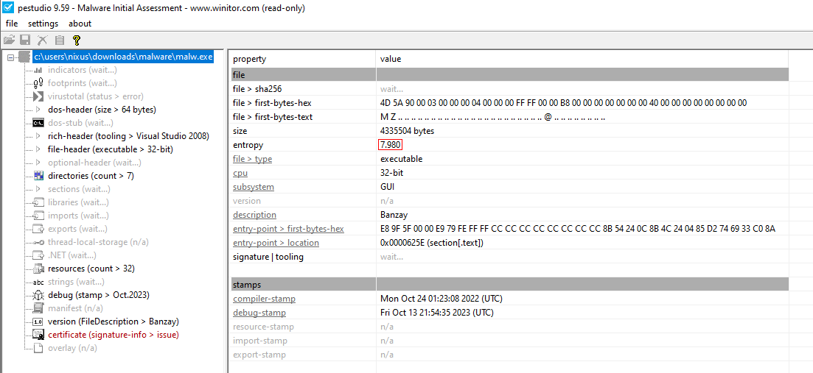
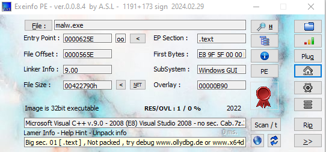

# Part 9: Static Analysis of an Executable File Using Flare VM

## Setting Up Your Malware Analysis Environment

1. **Set Up Windows 10 VM**  
   - Create a Windows 10 virtual machine (VM) with the following hardware specifications:  
     - **8 GB RAM**  
     - **70 GB storage**  
     - **2 processors**  
   - Add a NAT adapter to enable internet access for FLARE VM installation.  
   - Follow the official FLARE VM documentation on [GitHub](https://github.com/mandiant/flare-vm) or refer to this [YouTube guide](https://www.youtube.com/watch?v=DUzG1UDCjq4&list=LL&index=2&t=7s&ab_channel=cyberMED). 

2. **Disable Windows Updates**  
   - Press `Windows + R`, type `gpedit.msc`, and press Enter.  
   - Navigate to:  
     `Computer Configuration → Administrative Templates → Windows Components → Windows Updates → Configure Automatic Updates → Disable`.  
   - Run `gpupdate` in Command Prompt to apply changes.  

3. **Disable Microsoft Defender Antivirus**  
   - Press `Windows + R`, type `gpedit.msc`, and press Enter.  
   - Navigate to:  
     `Computer Configuration → Administrative Templates → Windows Components → Microsoft Defender Antivirus → Turn Off Microsoft Defender Antivirus → Enable`.  
   - Run `gpupdate` in Command Prompt to apply changes.  

4. **Disable Real-Time Protection**  
   - Press `Windows + R`, type `gpedit.msc`, and press Enter.  
   - Navigate to:  
     `Computer Configuration → Administrative Templates → Windows Components → Microsoft Defender Antivirus → Real-Time Protection → Turn Off Real-Time Protection → Enable`.  
   - Run `gpupdate` in Command Prompt to apply changes.  
-------
### 📝 Notes 🚨  
Some malware uses techniques to detect sandbox environments by checking the hostname. Hostnames such as "Sandbox," "Malware," "Cuckoo," or default VM names are often flagged, causing the malware to avoid execution.  
To bypass these checks:  
- Use a random, non-suspicious name for your VM hostname to mimic a typical user's system.  
- To rename the device:  
  1. Go to `Settings → System → About`.  
  2. Click the `Rename this PC` button and choose a non-suspicious name.  
-------
### Conducting Your First Malware Analysis with Mandiant FLARE VM  

1. Isolate Your Environment  
- **VM Communication**: Ensure that the virtual machines (e.g., FLARE, REMnux) are configured to communicate only with each other. This isolation prevents malware from affecting your physical host or network.  

2. Restrict Internet Access  
- Limit internet access for the malware analysis VM unless it is absolutely necessary. This measure enhances security by reducing exposure to external threats.  

3. Prepare Your Workspace  
- Always start your analysis from a clean snapshot of your VM to ensure a pristine environment.  
- Name the baseline snapshot something recognizable, like `flare_vm_snapshot`. This will serve as your safe starting point for all analyses.  
-------
### Malware Sample Sources for Analysis

1. [The Zoo](https://github.com/ytisf/theZoo)
2. [MalwareBazaar](https://bazaar.abuse.ch)
3. [VX Heaven](https://vx-underground.org)
4. [Contagio Malware Dump](https://contagiodump.blogspot.com)


***

## Static analysis : 
**Static analysis** is the process of examining a program or malware without executing it, focusing on its code structure, binary contents, and embedded resources. This approach helps identify potential malicious behaviors, vulnerabilities, and obfuscation techniques while ensuring a safe environment, as the code is not run during the analysis. It is crucial for uncovering hidden logic, hardcoded values, and guiding further dynamic analysis.  

You can download the malware sample from [here](https://bazaar.abuse.ch/sample/31095cd8210c0dc8061090055014e5bf7990e5835378bdfd0372c416355b9cac/).

---

### File Type Detection

#### Using the `file` Command
The file type can be determined by running the following command in **cmder**:
   
   ```bash
   file malware_destination
   ```

   

#### using HxD
Alternatively, use HxD, a hex editor, to manually inspect the file type. File extensions or signatures can be used to identify the file type. For instance:

- "MZ" (hex decoded as 4D 5A) at the beginning of the file indicates it's a DOS MZ executable.

   

- Malware can disguise itself by changing its name or extension (e.g., renaming .exe to .png), but the signature remains unchanged, allowing detection.

   

You can also use signatures to identify other potential formats. Reference a signature database such as [Gary Kessler's file signature list](https://www.garykessler.net/library/file_sigs.html).

#### Checking for Architecture (32-bit vs 64-bit)
You can determine whether a file is a 32-bit or 64-bit executable by inspecting its signatures in HxD:
- Look for the string **PE..L**. The "L" indicates the file is 32-bit.
- Conversely, **PE..D** indicates a 64-bit architecture.

---

### VirusTotal Analysis
[**VirusTotal Website**](https://www.virustotal.com/gui/)

#### Understanding Hashes
A **hash** is like a unique "fingerprint" for a file. Files cannot be identified just by their name because names are easily changed by attackers. However, a hash will always remain the same for a specific file. You can use the hash (MD5, SHA256, etc.) to scan a file on VirusTotal, which will show information about the file and its scan results from **67 different antivirus engines**.

#### How to Obtain a File's Hash
You can use tools like **HashCalc** or **HashMyFiles** then :

1. Open the tool and enter the file's path into the input field (data space).  
2. The tool will generate the file's hash value (MD5 or SHA256).  
3. Copy this hash and paste it into the VirusTotal search bar to see the scan results.


#### Interpreting VirusTotal Results
When you search for a file hash on VirusTotal, you will encounter several sections:

1. Detection: Displays results from antivirus scans and classifies the file type. Files can be marked:
   - Undetected (safe)
   - Malware (e.g., Trojan, ransomware, trojan-banking, etc.)

   
   
2. Details: Provides metadata, such as file names, creation time, first time observed, and information about file packing.

   

3. Relations: Displays hashes of related files that have been uploaded and analyzed on VirusTotal.

   
   
4. Behavior: Shows how the file interacts with a system during execution.

   
   
5. Community: Contains user opinions and analysis of the file based on shared observations.

   

---

### Strings Analysis
The `strings` command extracts readable text from binaries, which can provide insights into the behavior, intent, or command structure of a malware sample.
To analyze embedded strings in the malware, use the following command:

   ```bash
   strings -n 5 malware_destination > output.txt
   ```

This extracts all strings with a minimum length of 5 characters and saves them into an output file because the results may be extensive.

#### Key Information to Extract from Strings:

1. **Libraries & Imports**  
Common libraries used by malware for various purposes:  
  - `mscoree.dll`: Microsoft .NET runtime library, indicating the program may rely on .NET framework for execution.
  - `KERNEL32.DLL`: Core Windows API library for kernel-related functions like memory management, I/O operations, etc.
  - `USER32.DLL`: Provides user interface components and interactions such as MessageBox and window-related operations.
  - `GDI32.dll`: Graphics Device Interface library for graphical output and rendering.
  - `ADVAPI32.dll`: Advanced API library for security and registry-related operations.
  - `SHELL32.dll`: Handles shell-related functionalities like file associations and desktop management.
  - `WINHTTP.dll`: Indicates network or internet-related activities using the Windows HTTP Services.
  - `msimg32.dll`: Microsoft Image library, often used for image manipulation.

2. **API Functions**  
- From KERNEL32.dll:
   - `VirtualAlloc`, `VirtualFree`, `VirtualProtect`: Memory allocation and protection management.
   - `GetProcAddress`, `LoadLibraryA`: Dynamically loading and resolving function addresses.
   - `GetTickCount`: Retrieves system uptime in milliseconds.
   - `InterlockedIncrement`, `InterlockedDecrement`: Thread-safe operations.

- From USER32.dll:
   - `MessageBoxA`: Displays a message box.
   - `GetActiveWindow`: Retrieves the currently active window.

- From ADVAPI32.dll:
   - `RegOpenKeyA`: Registry key manipulation.

- From WINHTTP.dll:
   - `WinHttpOpen`, `WinHttpReadData`: Indicating potential HTTP communication.

3. **Runtime Errors**  
Strings like:  
   - `"bad allocation"`  
   - `"Runtime Error!"`  
   - `"not enough space for environment"`  
These strings suggest the malware might attempt to mislead analysts or include error-handling mechanisms for anti-analysis purposes.

4. **Localization Strings**  
Strings like `"Monday"`, `"December"`, `"HH:mm:ss"` suggest localized malware targeting specific locales.

5. **Encoded Data**  
Strings like `"kugunedahapolubasitizatirisedux"` may represent Obfuscated or encrypted data.

---

### Categories of Potential Malware Behaviors

Based on analysis, malware can exhibit behaviors such as:

1. **Discovery & Information Stealing**  
`GetComputerNameA` (retrieves system name for reconnaissance)
`FindFirstFileW` (scans for files)
`PeekNamedPipe` (intercepts data streams)
`RegOpenKeyA` (accesses registry for sensitive data)
`WinHttpOpen`, `WinHttpReadData`, `WinHttpSendRequest` (used for HTTP-based communication for exfiltration)

2. **Persistence Mechanisms**  
Ensures malware persists on reboot with commands like `SetFileAttributesW`, `UpdateResourceA`.  

3. **Loader Behavior**  
Loads malicious payloads into memory dynamically.  

4. **Dropper Behavior**  
Deploys payloads using commands like `CreateFileA`, `WriteFile`.  

5. **Rootkit Capabilities**  
Commands like `SetKernelObjectSecurity` hide operations.

6. **Process Injection**  
Injects malicious payloads into legitimate processes.

---

### Searching for Specific Patterns with `grep`

Filter strings for particular patterns using **grep**:
   1. Search for URLs:  
   `grep -E 'http|https|ftp'`  
   2. Search for IP addresses:  
   `grep -Eo '([0-9]{1,3}\.){3}[0-9]{1,3}'`  
   3. Search for system paths:  
   `grep -E 'C:\\Windows\\System32'`  
   4. Search for system commands:  
   `grep -E 'cmd.exe|powershell.exe'`
   5. Search for commands:
   `strings sample.exe | grep -E 'curl|wget|ping'`  

---

### Decoding Malware

Common decoding techniques to analyze obfuscated payloads include:

#### 1. XOR Search

**XORSearch** is a tool that detects and decodes XOR-encoded strings in binary files, commonly used by malware to obfuscate its content. It is crucial for uncovering hidden data such as URLs, commands, or encryption keys, making it a key tool in identifying indicators of compromise and understanding malware behavior.  

- `xorsearch malware.exe http`  
- `xorsearch malware.exe This`  
- `xorsearch malware.exe Create`

---

#### 2. FLOSS

**Floss (FireEye Labs Obfuscated String Solver)** extracts obfuscated strings from malware samples, including those revealed only during execution. It is vital for analyzing malware's intent, uncovering hidden IoCs like IPs or registry keys, and simplifying both static and dynamic analysis processes.
```bash
floss malware.exe
```

### Packed Files
Packed files are executable files that have been **compressed, encrypted, or obfuscated** to conceal their true functionality and behavior. Malware creators use these techniques to make it more difficult for security researchers or antivirus software to analyze or detect their malicious intent. Packing hides how the malware operates, making reverse engineering harder by disguising the payload or modifying its structure.

---

#### Determining if the File is Packed
We can detect if a file is packed by analyzing **entropy**, which measures the **randomness or unpredictability** of data within a file. Entropy is a statistical measure that calculates how unpredictable a file's data is:  

- **Low Entropy (~1.0)**: Indicates normal, uncompressed, or predictable data.  
- **High Entropy (~6.0 - 8.0)**: Indicates obfuscation, compression, encryption, or packing.  

A higher entropy value suggests that the data has undergone transformations, such as packing or encryption, which hide its real behavior or payload. By analyzing sections of data with unusually high entropy, researchers can identify potential signs of packing or obfuscation. Tools like `Detect It Easy (DIE)`, `Exeinfo PE` or `PEStudio` can identify packed files and the specific packer used.

#### Identifying Packed Files with Tools:
1. **Detect It Easy (DIE)**: 
   - Open the malware sample in DIE.
   - The tool will display information about packers or protections used.
   
   

2. **PEStudio**:  
   - Use PEStudio to calculate entropy and identify unusual patterns.
   - A normal executable typically has an entropy value of 5-7. Values higher than 7 often indicate packing or encryption.
   
   

3. **Exeinfo PE**:
   - Load the malware sample in Exeinfo PE to check for known packers.

   

**Results:** 
- **DIE** and **PEStudio** identified high entropy, indicating that the file is likely packed or obfuscated.
- **Exeinfo PE** did not detect any packer, suggesting the file is packed with a packer it does not recognize or support. The packer likely uses custom or modified techniques that evade detection by signature-based tools.

#### Unpacking Packed Malware
To analyze packed malware, you need to unpack it using the following methods:
- Automatic Unpacking :
   - If you know the packing mechanism (e.g., UPX), you can use automated tools to unpack the file directly:
   Example with UPX:
      ```bash
      upx -d malware.exe
      ```
      This will decode and extract the original executable from the UPX packer if it uses UPX.
  
- Manual Debugging
   - Use tools like x64dbg or OllyDbg to trace and reverse the unpacking routine, identify memory regions, and dump the payload.

---

## Conclusion
In this part, we explored malware static analysis using FLARE VM, focusing on file identification, VirusTotal analysis, string extraction, and behavioral patterns. We examined key indicators like system libraries, command structures, and obfuscation techniques to determine potential malicious behaviors.

In the next part, we will perform **PDF static analysis** using another popular sandbox **REMnux** to further our investigation into malware and its detection techniques
