# Part 9: Static Analysis of PDF Documents Using REMnux

## Setting Up Your Malware Analysis Environment
- **Download the Remnux virtual appliance** from: https://docs.remnux.org/install-distro/get-virtual-appliance#download-virtual-appliance
  
- **Import the downloaded Remnux appliance** into VMware.  
  - Allocate **2 processors**, **4 GB of RAM**, and **60 GB of storage** to ensure the appliance runs smoothly.
  - Configure either a **NAT** or **bridge adapter** to enable internet access for downloading malware samples.  
  - Alternatively, you can set up a **vlan50 adapter** to transfer samples from a Flare VM using WinSCP.  

- **Changing the Hostname**

  To make analysis easier and personalize your environment:
  - Change the hostname with the following command:
  
  ```bash
  sudo hostnamectl set-hostname my-machine
  ```

  - Edit the `/etc/hosts` file to reflect the new hostname:
  Replace `127.0.1.1 remnux` with:

  ```bash
  127.0.1.1       my-machine
  ```

---

## Conducting Your First Malware Analysis with Remnux
### 1. Downloading the Malware Sample
We’ll use a malware sample from the "Suspicious USB stick" challenge on [Blue Team Labs Online](https://blueteamlabs.online/home/challenge/suspicious-usb-stick-2f18a6b124).

- Navigate to the challenge page and locate the "Download File" link.
- Right-click on the "Download File" button and select "Copy Link Address."
- Open the Remnux terminal and use wget to download the file:
  ```bash
  wget https://blueteamlabs.online/storage/files/aqCyykCIBZVselBnncQ0om8ADYSUMYa8AC8NYPXC.zip
  ```

- After downloading, review the sample and its related documentation provided by the challenge for context and additional reading material.

### 2. Restricting Internet Access
After downloading the sample:
  - Disable internet access by replacing the NAT/bridge adapter with the vlan50 adapter. This step enhances security by limiting exposure to external threats during analysis.

---

## Static Analysis with Remnux
### Unzipping the Malware File
The malware archive contains nested zip files:
  1. Extract `aqCyykCIBZVselBnncQ0om8ADYSUMYa8AC8NYPXC.zip` using the password `btlo`.

  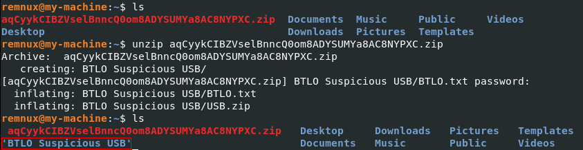
  
  2. Then extract `USB.zip` using the password `infected`.

  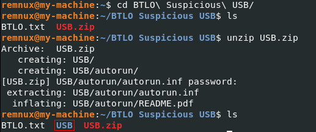
  
The analysis will focus on these files:
  - `autorun.inf`
  - `README.pdf`

  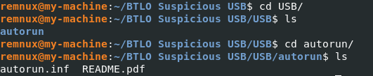
  
### File Type Identification
1. **README.pdf Analysis**
  - Using the `file` Command:
  
    ```bash
    file README.pdf
    ```
  
    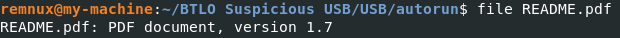
  
    - The file is confirmed to be a PDF (version 1.7).
  
  - Using `xxd` for Hex Inspection:
    PDF files typically begin with the signature `25 50 44 46`. Run:
  
    ```bash
    xxd -l 10 README.pdf
    ```

    - Output shows the sequence 25 50 44 46, confirming it's a PDF.

      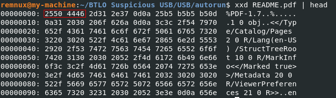

2. **autorun.inf Analysis**
  - Using the `file` Command:

    ```bash
    file autorun.inf
    ```

    - Output reveals it is a Microsoft Windows autorun file.

      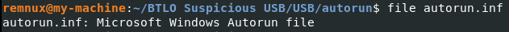

---

### VirusTotal Analysis
- Generate a 256-bit hash for analysis using:

  ```bash
  sha256sum *
  ```

    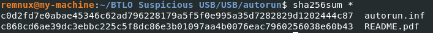

- **autorun.inf** hash: Submitted to VirusTotal revealed only 1 antivirus detection.

    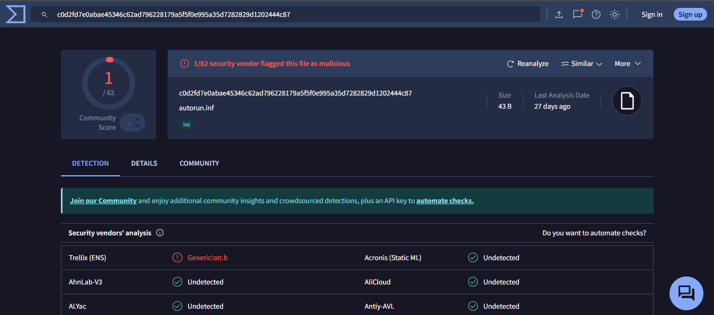
  
- **readme.pdf** hash: Submitted to VirusTotal revealed 42 detections, categorized as Trojan, Dropper, and related to JS embedding.

    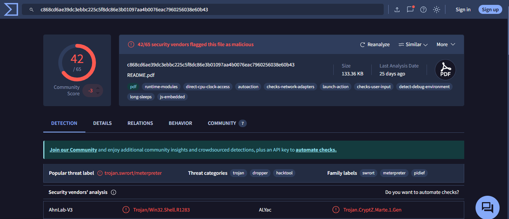

- **Observations about autorun.inf**
  - The **autorun.inf** file has an action defined:
    `open=README.pdf`

    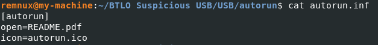

    - This indicates that plugging in the `USB` will trigger `README.pdf` automatically, potentially executing malicious payloads.

---

### PDF Analysis with pdfid
PDF files are composed of a hierarchical structure of objects that define their content, layout, and interactive features. Examples of these components include:
  - Catalog: The root object linking to the overall structure of the document, including the page tree and other metadata.
  - Page Tree: Organizes all the pages hierarchically, allowing easy navigation.
  - Objects: Fundamental building blocks of a PDF, such as pages, fonts, annotations, and embedded data.
  - Streams: Encoded data embedded in the file, such as images or content instructions.
  - Xref Table and Trailer: Facilitate quick object access by storing offsets in the file.
  - JavaScript, Actions, and Launch Objects: Interactive elements that can trigger scripts or external programs, which are commonly exploited in malicious PDFs.

Run the following to identify risky keywords:

  ```bash
  pdfid.py README.pdf -n
  ```

  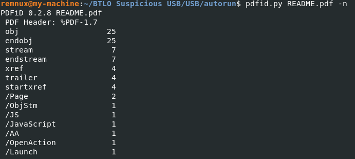

**Key Findings**
- `/OpenAction` & `/AA`: Indicate actions or scripts to execute on opening.
- `/JavaScript` & `/JS`: Suggest JavaScript payloads embedded within the document.
- `/ObjStm`: Suggests hidden streams or obfuscated objects.

---

### PDF Analysis with peepdf
Run peepdf in interactive mode to explore objects:

```bash
peepdf -i README.pdf
```
After entering the interactive mode, input the desired object to inspect.

#### Observations from peepdf Analysis

**1. Binary Analysis**

  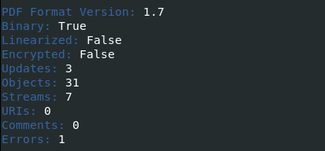
  
  - Binary: True — The file contains binary data.
  - Encrypted: False — No encryption is applied to the document.
  - Updates: 3 — Indicates the file has undergone three incremental updates.
  - Objects: 31 — Total number of objects in the PDF.
  - Streams: 7 — Indicates embedded binary or text data streams.
  - URIs: 0 — No external links (URLs) detected.
  - Errors: 1 — One issue detected within the document, likely corrupt or malformed.
  - PDF Versions: Besides version 0, other versions signify incremental updates to the PDF, potentially introducing new objects or changes.

**2. Focus on Suspicious Version**

  - Our attention is on `version 2`, as it contains suspicious elements. We proceed by analyzing Object 1 for `/OpenAction`.
  
    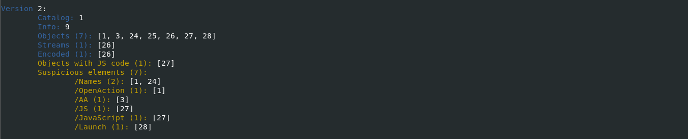
  
#### Step-by-Step Object Analysis

- **Object 1: `/OpenAction`**
  - When examining Object 1, it triggers an action when the document is opened and points to Object 27.

  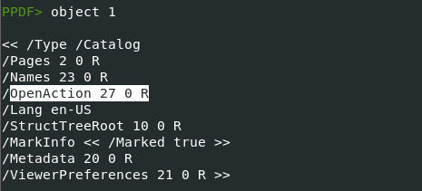

- **Object 27 Analysis:**
  - Object 27 contains `/S /JavaScript`, which indicates that it runs JavaScript. The script attempts to dynamically load or export a specific payload named `README`.

  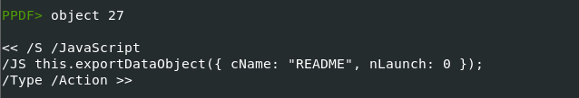

- **Object 3: `/AA`**
  - This object defines an action (`/AA`) that points to Object 28.

  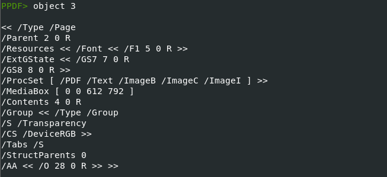
  
- **Object 28 Analysis:**
  - Object 28 is an action type object that executes shell commands using `cmd.exe`.
  - The command sets the working directory to `C:\Windows\System32`.
  - Executes the following silently: `/P /Q /C` to locate and attempt to open `README.pdf` in common user directories.
  - This command execution is an attempt to load and run the file `README.pdf`. If it contains malicious code, execution could be triggered.

  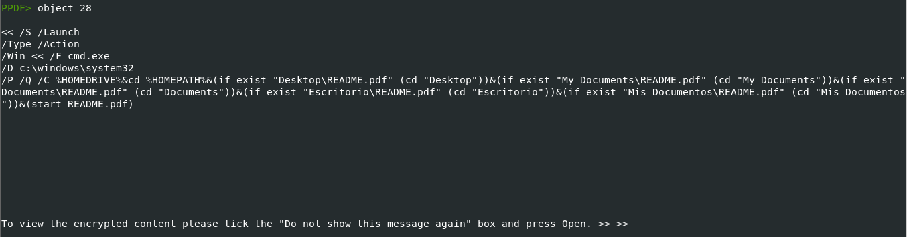
  
**Final Observations**
1. Object 1 with Object 27:
  - Object 27, executed automatically via `/OpenAction` defined in Object 1, attempts to execute JavaScript using the command:
  
  ```javascript
  this.exportDataObject({ cName: "README", nLaunch: 0 });
  ```

  - This suggests a dynamic attempt to load or execute data from `README.pdf`.

2. Object 3 with Object 28:
  - Object 3 defines a behavior tied to `/AA` that invokes Object 28.
  - Object 28 executes shell commands via `cmd.exe`, attempting to open `README.pdf` across common user directories. This serves as a potential trigger mechanism for executing malicious payloads.

---

## Summary
Now, after completing this comprehensive cybersecurity project, we reflect on the journey that has shaped my understanding and skills.

We began by deploying a pfSense firewall to protect the network perimeter, ensuring that our infrastructure was well-guarded from external threats. Then, we moved on to setting up Active Directory and Group Policy Objects (GPOs) on Windows Server 2019, creating a solid foundation for managing users and permissions. Following this, we configured an Ubuntu server and installed DVWA to simulate a vulnerable web application for practical testing and training.

Our next step was building a robust corporate WAN, during which we set up Kali Linux to perform attacks on our DVWA web server for security testing. Following that, we installed and configured Security Onion to monitor network traffic and detect suspicious activities. To further enhance our defenses, we implemented Host Intrusion Detection Systems (HIDS) using Wazuh on our Active Directory machines and set up a Network Intrusion Detection System (NIDS) for the DVWA web server using Snort and Splunk, ensuring comprehensive monitoring of both host and network activities.

On the malware analysis side, I learned and applied static analysis techniques with FLARE VM and REMnux to investigate potentially malicious files, enhancing my ability to identify and analyze threats.

This project has been an essential step in developing my cybersecurity skills, and I hope it serves as just the beginning of my journey in the field, with many more challenges and opportunities ahead.
