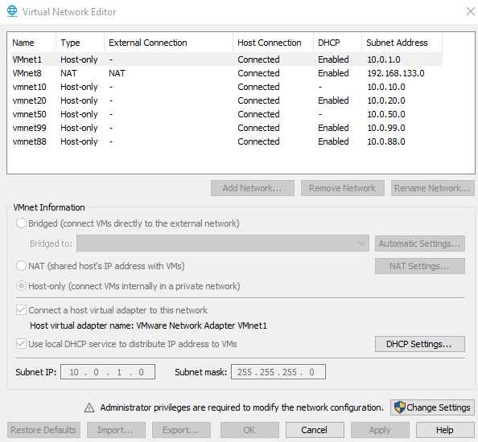

# Building a Blue Team Homelab

## Motivation

As a network engineering graduate, I’ve always been drawn to technology and its potential, but I was still searching for the specific field that would become my focus. That changed when I discovered cybersecurity—a dynamic and rapidly growing area with endless learning potential. To immerse myself, I began studying through platforms like TryHackMe, Cybrary, and Hack The Box. I read numerous books and articles, watched tutorials, and followed cybersecurity discussions online. Yet, I quickly realized that learning concepts alone wouldn’t give me the depth I wanted. I needed hands-on, practical experience.

Through my research, I found that many cybersecurity professionals highly recommend building a homelab. This advice was echoed across online communities like StackOverflow, Reddit, and GitHub, where countless professionals shared their homelab setups as a stepping stone into the industry. Following their guidance, I decided to create my own blue team homelab—a dedicated space where I could apply my skills, experiment, and truly understand how cybersecurity tools and strategies operate in real-world scenarios.

In planning my lab, I explored countless articles, blog posts, and setup guides, drawing inspiration from people who had built their own labs on platforms like Medium and Reddit. My goal was to create an environment where I could do more than configure tools; I wanted to see the impact of different configurations and understand the full picture of defensive cybersecurity. This homelab became my personal sandbox for learning, experimentation, and skill-building.

---

## Project Overview

To create a comprehensive learning experience, I structured my homelab to encompass several essential blue team components:

### 1. **Firewall (pfSense)**
   A firewall is the frontline of network defense, so setting one up was a priority. I chose pfSense, an open-source firewall solution, to manage network traffic, filter data packets, and secure the perimeter. The principles learned with pfSense—like access control, NAT configurations, and monitoring logs—apply to enterprise-grade firewalls from brands like Cisco, Palo Alto, or Fortinet. By mastering the fundamentals here, I’ll be well-prepared to work with any firewall in the future.

### 2. **Active Directory (AD)**
   Coming from a networking background, I was already familiar with Microsoft’s Active Directory, which is widely used for managing user access and network resources. In my homelab, I set up AD along with essential services like DHCP, DNS, and Group Policy Objects (GPOs). This part of the lab allowed me to refresh and deepen my knowledge of AD administration and practice configuring a domain environment.

### 3. **Web Server (DVWA)**
   To simulate a typical web environment, I deployed an Ubuntu server running DVWA (Damn Vulnerable Web Application). DVWA is an intentionally vulnerable web app used for learning and practicing web application security. This setup allowed me to explore web server management, learn more about web vulnerabilities, and practice securing a server—essential knowledge for anyone working in cybersecurity.

### 4. **Simulated External Network (Fake WAN)**
   Cybersecurity doesn’t just involve defending from within; it’s essential to understand the nature of external threats. To simulate this, I created a “fake WAN” network that includes a Kali Linux machine, representing a malicious attacker. This setup enables me to practice defending against common cyber-attacks in a controlled environment, providing a taste of real-world attack scenarios.

### 5. **Security Information and Event Management (SIEM)**
   SIEM tools are indispensable for monitoring, collecting, and analyzing security events, particularly in SOC environments. I integrated Security Onion into my lab, a comprehensive SIEM solution. With it, I can analyze incidents, collect indicators of compromise (IOCs), and gain hands-on experience in using a SIEM for threat detection and response—a critical skill for cybersecurity professionals.

### 6. **Host-Based Intrusion Detection System (HIDS)**
   Using Security Onion as a Wazuh manager, I collected Active Directory logs through the Wazuh agent installed on domain-connected machines. This setup allowed me to detect and analyze common attacks targeting Active Directory, enhancing my incident detection and response capabilities.

### 7. **Network-Based Intrusion Detection System (NIDS)**
   To monitor my network, I implemented Snort IDS with its default rules to detect attacks on the DVWA web server. Additionally, I created custom rules to identify undetected threats. To complete the SIEM solution, I integrated Snort with Splunk, enabling centralized event visualization, advanced searching, correlation, and alerting. This setup helps me quickly identify and respond to attacks targeting my web server.
   
### 8. **Malware Analysis Lab**
   Recognizing malware as a significant threat, I created an isolated environment for malware analysis using Flare VM and REMnux. This lab enables me to conduct both static and dynamic analysis of malware samples, including executable and PDF files, in a secure environment. These skills are invaluable for professional cybersecurity roles and personal awareness of malware threats.

---

## Acknowledgments and Key Resources 

This project is the result of a dedicated effort to build and refine a cybersecurity homelab. Throughout this journey, I relied on several invaluable resources that guided my learning and implementation:  

- **[Facyber](https://facyber.me/posts/blue-team-lab-guide-part-1/) :** Their *Blue Team Lab Guide* provided clear and actionable insights that were instrumental in building and configuring my lab.  

- **[Cyberwox Academy](https://cyberwoxacademy.com/building-a-cybersecurity-homelab-for-detection-monitoring/) :** Their comprehensive guide on constructing a cybersecurity homelab served as a constant reference.  

- The following books, which were essential in deepening my understanding and practical skills:  
  - *Mastering pfSense, Second Edition*.
  - *Practical Malware Analysis: The Hands-On Guide to Dissecting Malicious Software*.  
  - *Linux Basics for Hackers*.

---

## Hardware Requirements

This project is powered by an 8th-gen Intel i5 processor, 24GB DDR4 RAM, and a 512GB NVMe SSD running on Windows 10. While I encountered a few storage challenges, the hardware setup allowed me to run multiple virtual machines (VMs) smoothly.

## Tools Used

I relied on the following tools to set up and manage my lab:

- **VMware Workstation**: My go-to tool for managing virtual machines. While VirtualBox is a solid alternative that I’ve used in the past, VMware’s features made it my preferred choice for this homelab.
- **Draw.io**: This open-source tool was invaluable for designing network topologies and visualizing lab setups, thanks to its extensive icon library (including Cisco, AWS, and Microsoft icons).
- **KeepNote**: A robust note-taking app where I documented every detail—from IP addresses and login credentials to VM configurations and procedural steps. Keeping organized records in a central place allowed me to track my progress and troubleshoot issues effectively.

## Networking & VLAN Configuration

This homelab includes multiple VMs, each assigned to specific VLANs to simulate a diverse, segmented network. After careful planning, I implemented five VLANs to separate network functions:

1. **VLAN 1 (Management)**: Used to access the firewall’s web GUI and manage other network elements.
2. **VLAN 10 (Corporate WAN/Fake WAN)**: This VLAN simulates an external network, including a Kali Linux machine to mimic external attacks. For security, it has restricted access only to the corporate LAN.
3. **VLAN 20 (Corporate LAN)**: Hosting internal servers and end devices, this network has limited external access.
4. **VLAN 50 (Security)**: Dedicated to security functions like DFIR and OSINT, this VLAN can access the corporate network to retrieve logs and files.
5. **VLAN 99 (Isolated LAN)**: Specifically for malware analysis, this isolated VLAN ensures that malware samples do not affect other networks or devices.

Each VLAN has its own subnet, and static IPs are configured to maintain clarity across the network. Here’s an overview of the network setup:

| Name             | Domain       | VLAN | Subnet        | Gateway      |
|------------------|--------------|------|---------------|--------------|
| Management       | N/A          | 1    | 10.0.1.0/24   | 10.0.1.1     |
| Corporate WAN    | N/A          | 10   | 10.0.10.0/24  | 10.0.10.254  |
| Corporate LAN    | nixus.homelab | 20 | 10.0.20.0/24  | 10.0.20.254  |
| Security         | nixus.homelab | 50 | 10.0.50.0/24  | 10.0.50.254  |
| Isolated LAN     | N/A          | 99   | 10.0.99.0/24  | 10.0.99.254  |

## Lab Setup
### VLAN Creation

The final step is to create these VLANs in VMware (or your preferred virtualization tool), preparing everything for the next stages.

1. In VMware, go to **Edit > Virtual Network Editor**.
2. Add four networks by clicking the **Add Network…** button and name them **vmnet10**, **vmnet20**, **vmnet50**, and **vmnet99**. Set all of these network types to **Host-only**.
3. For each network, uncheck the field **Use local DHCP service to distribute IP addresses to VMs**. This is necessary because we’ll be using our firewall as the DHCP server.
4. Assign each network its corresponding subnet IP as specified in the table above (or choose other subnets if preferred).

After configuration, the setup should resemble the following image:

### Topology
This is how our topology should look now, after VLAN segmentation and device separation by VLANs/subnets.

---

## Conclusion

So far, we’ve successfully created the VLANs for our network, assigned subnets, and established a clear network topology for the homelab. This foundational setup ensures that each part of our environment operates independently, providing the security and flexibility needed for the next steps. But this is just the beginning – the next phase will involve configuring our firewall, setting up virtual machines, and diving deeper into the specific security tools and processes that will form the core of this blue team lab.
